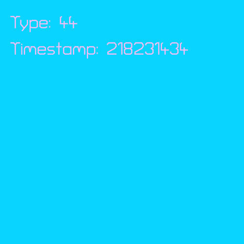
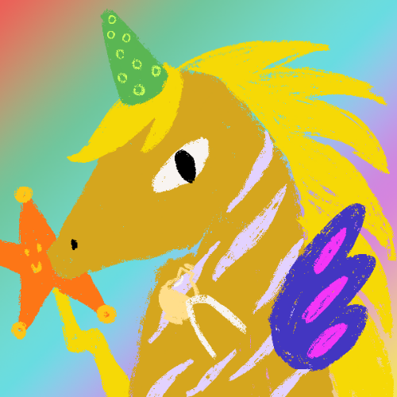
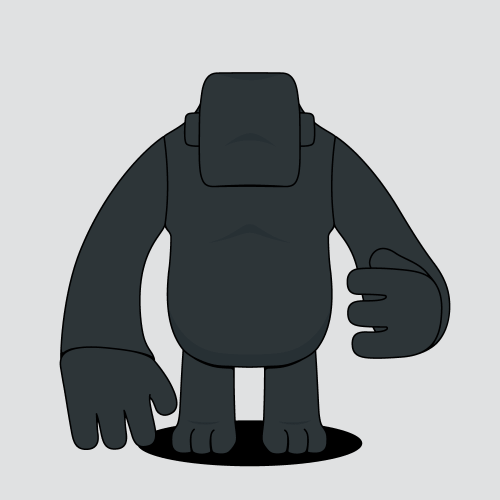
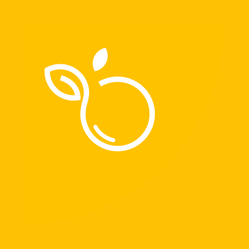
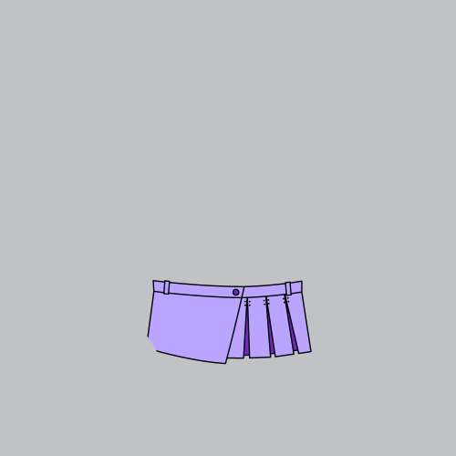
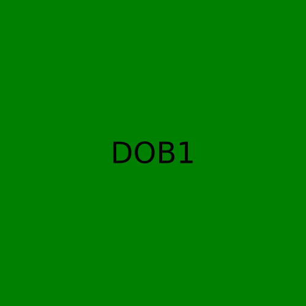
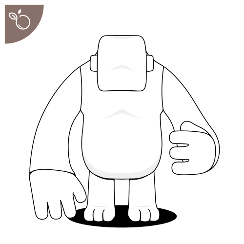

# dob-cookbook
A comprehensive collection of Digital Object (DOB) protocol examples and best practices on Nervos CKB. This repository is a practical guide for DOB issuers, demonstrating various implementation patterns and rendering effects.

## Introduction

Digital Objects (DOBs) represent a groundbreaking protocol suite for creating, managing, and trading digital assets on Nervos CKB. This cookbook provides a comprehensive set of examples and patterns to help DOB issuers implement their digital asset solutions effectively.

## Why DOB?

Digital Objects (DOBs) offer several unique advantages:
- **Composability**: Build complex digital assets by combining simpler ones
- **Extensibility**: Easily extend functionality through protocol extensions
- **Interoperability**: Seamless interaction between different DOB implementations
- **Efficiency**: Optimized for on-chain storage and verification
- **Flexibility**: Support for various digital asset types and use cases

## Examples

Each example in this cookbook includes:
- Detailed implementation code
- Rendered visual effects
- Usage instructions
- Best practices and considerations

### DOB/0 Examples

<table>
  <tr>
    <td align="center" width="300">
      

        <a href="examples/dob0/0.basic-loot.md">
          
          
          <b>Basic Loot</b>
          
        </a>
      

    </td>
    <td align="center" width="300">
      

        <a href="examples/dob0/1.colorful-loot.md">
          
          
          <b>Colorful Loot</b>
          
        </a>
      

    </td>
    <td align="center" width="300">
      

        <a href="examples/dob0/2.regular-link-png.md">
          
          
          <b>Regular Link PNG</b>
          
        </a>
      

    </td>
  </tr>
  <tr>
    <td align="center" width="300">
      

        <a href="examples/dob0/3.btcfs-i0-png.md">
          
          
          <b>BTCFS PNG</b>
          
        </a>
      

    </td>
    <td align="center" width="300">
      

        <a href="examples/dob0/4.ipfs-png.md">
          
          
          <b>IPFS PNG</b>
          
        </a>
      

    </td>
    <td align="center" width="300">
      

        <a href="examples/dob0/5.regular-link-svg.md">
          
          
          <b>Regular Link SVG</b>
          
        </a>
      

    </td>
  </tr>
  <tr>
    <td align="center" width="300">
      

        <a href="examples/dob0/6.btcfs-i0-svg.md">
          
          
            <b>BTCFS SVG (i0)</b>
          
        </a>
      

    </td>
    <td align="center" width="300">
      

        <a href="examples/dob0/7.btcfs-i1-png.md">
          
          
            <b>BTCFS PNG (i1)</b>
          
        </a>
      

    </td>
    <td align="center" width="300">
      

        <a href="examples/dob0/8.btcfs-i1-svg.md">
          
          
            <b>BTCFS SVG (i1)</b>
          
        </a>
      

    </td>
  </tr>
  <tr>
    <td align="center" width="300">
      

        <a href="examples/dob0/9.random-img.md">
          
          
            <b>Random Image</b>
          
        </a>
      

    </td>
  </tr>
</table>

### DOB/1 Examples

<table>
  <tr>
    <td align="center" width="300">
      

        <a href="examples/dob1/0.basic-shape.md">
          
          
          <b>Basic Shape</b>
          
        </a>
      

    </td>
    <td align="center" width="300">
      

        <a href="examples/dob1/1.spore-genesis(svg_bg_btcfs_icon).md">
          
          
          <b>Spore Genesis (svg_bg_btcfs_icon)</b>
          
        </a>
      

    </td>
    <td align="center" width="300">
      

        <a href="examples/dob1/2.nervape-genesis(btcfs_bg_btcfs_icon).md">
          
          
          <b>Nervape Genesis (btcfs_bg_btcfs_icon)</b>
          
        </a>
      

    </td>
  </tr>
  <tr>
    <td align="center" width="300">
      

        <a href="examples/dob1/3.azuki-genesis(ipfs_bg_btcfs_icon).md">
          
          
          <b>Azuki Genesis (ipfs_bg_btcfs_icon)</b>
          
        </a>
      

    </td>
    <td align="center" width="300">
      

        <a href="examples/dob1/4.nervape-compose(btcfs).md">
          
          
          <b>Nervape Compose (btcfs)</b>
          
        </a>
      

    </td>
  </tr>
</table>

## Compatibility Overview

### DOB0 Compatibility
- **Testnet**

|    Case                                                 | JoyID | Omiga | CKB Explorer | Mobit | Dobby |
| ------------------------------------------------------- | ----- | ----- | ------------ | ----- | ----- |
| [Basic Loot](examples/dob0/0.basic-loot.md)             | ✅    | ✅     | ✅           | ✅     | ✅    |
| [Colorful Loot](examples/dob0/1.colorful-loot.md)       | ✅    | ✅     | ✅           | ✅     | ✅    |
| [Regular Link PNG](examples/dob0/2.regular-link-png.md) | ✅    | ✅     | ✅           | ✅     | ✅    |
| [BTCFS PNG(i0)](examples/dob0/3.btcfs-i0-png.md)        | ✅    | ✅     | ✅           | ✅     | ✅    |
| [IPFS PNG](examples/dob0/4.ipfs-png.md)                 | ✅    | ✅     | ✅           | ✅     | ✅    |
| [Regular Link SVG](examples/dob0/5.regular-link-svg.md) | ✅    | ✅     | ✅           | ✅     | ✅    |
| [BTCFS SVG (i0)](examples/dob0/6.btcfs-i0-svg.md)       | ✅    | ✅     | ✅           | ✅     | ✅    |
| [BTCFS PNG (i1)](examples/dob0/7.btcfs-i1-png.md)       | ✅    | ✅     | ✅           | ✅     | ✅    |
| [BTCFS SVG (i1)](examples/dob0/8.btcfs-i1-svg.md)       | ✅    | ✅     | ✅           | ✅     | ✅    |
| [Random Image](examples/dob0/9.random-img.md)           | ✅    | ✅     | ✅           | ✅     | ✅    |

- **Mainnet**

|    Case                                                 | JoyID | Omiga | CKB Explorer | Mobit | Dobby |
| ------------------------------------------------------- | ----- | ----- | ------------ | ----- | ----- |
| [Basic Loot](examples/dob0/0.basic-loot.md)             | ✅    | ✅     | ✅           | ✅     | ✅    |
| [Colorful Loot](examples/dob0/1.colorful-loot.md)       | ✅    | ✅     | ✅           | ✅     | ✅    |
| [Regular Link PNG](examples/dob0/2.regular-link-png.md) | ✅    | ✅     | ✅           | ✅     | ✅    |
| [BTCFS PNG(i0)](examples/dob0/3.btcfs-i0-png.md)        | ✅    | ✅     | ✅           | ✅     | ✅    |
| [IPFS PNG](examples/dob0/4.ipfs-png.md)                 | ✅    | ✅     | ✅           | ✅     | ✅    |
| [Regular Link SVG](examples/dob0/5.regular-link-svg.md) | ✅    | ✅     | ✅           | ✅     | ✅    |
| [BTCFS SVG (i0)](examples/dob0/6.btcfs-i0-svg.md)       | ✅    | ✅     | ✅           | ✅     | ✅    |
| [BTCFS PNG (i1)](examples/dob0/7.btcfs-i1-png.md)       | ✅    | ✅     | ✅           | ✅     | ✅    |
| [BTCFS SVG (i1)](examples/dob0/8.btcfs-i1-svg.md)       | ✅    | ✅     | ✅           | ✅     | ✅    |
| [Random Image](examples/dob0/9.random-img.md)           | ✅    | ✅     | ✅           | ✅     | ✅    |

### DOB1 Compatibility
- **Testnet**

|    Case                                    | JoyID | Omiga | CKB Explorer | Mobit | Dobby |
| ------------------------------------------ | ----- | ----- | ------------ | ----- | ----- |
| [Basic Shape](examples/dob1/0.basic-shape.md)       | ✅    | ✅     | ✅           | ✅     | ✅    |
| [Spore Genesis(svg_bg_btcfs_icon)](examples/dob1/1.spore-genesis(svg_bg_btcfs_icon).md)   | ❌    | ✅     | ✅           | ✅    | ✅    |
| [Nervape Genesis(btcfs_bg_btcfs_icon)](examples/dob1/2.nervape-genesis(btcfs_bg_btcfs_icon).md)   | ✅    | ✅     | ✅           | ✅     | ✅    |
| [Azuki Genesis(ipfs_bg_btcfs_icon)](examples/dob1/3.azuki-genesis(ipfs_bg_btcfs_icon).md)   | ✅    | ✅     | ✅           | ✅     | ✅    |
| [Nervape Compose(btcfs)](examples/dob1/4.nervape-compose(btcfs).md)   | ✅    | ✅     | ✅           | ✅     | ✅    |

- **Mainnet**

|    Case          | JoyID | Omiga | CKB Explorer | Mobit | Dobby |
| ---------------- | ----- | ----- | ------------ | ----- | ----- |
| [Basic Shape](examples/dob1/0.basic-shape.md)       | ✅    | ✅     | ✅           | ✅     | ✅    |
| [Spore Genesis(svg_bg_btcfs_icon)](examples/dob1/1.spore-genesis(svg_bg_btcfs_icon).md)   | ❌    | ✅     | ✅           | ✅     | ✅    |
| [Nervape Genesis(btcfs_bg_btcfs_icon)](examples/dob1/2.nervape-genesis(btcfs_bg_btcfs_icon).md)   | ✅    | ✅     | ✅           | ✅     | ✅    |
| [Azuki Genesis(ipfs_bg_btcfs_icon)](examples/dob1/3.azuki-genesis(ipfs_bg_btcfs_icon).md)   | ✅    | ✅     | ✅           | ✅     | ✅    |
| [Nervape Compose(btcfs)](examples/dob1/4.nervape-compose(btcfs).md)   | ✅    | ✅     | ✅           | ✅     | ✅    |

Why there is no compatibility information for `Element` Market in this compatibility table?
- Testnet: The Element Market currently does not provide a corresponding testing environment;
- Mainnet: The Element Market needs to manually add the Cluster to the whitelist and perform some necessary settings to see the rendering result of the DOB in the Cluster;

## Contributing

We welcome contributions! Please read our [Contributing Guidelines](CONTRIBUTING.md) before submitting your examples.

## Resources
- DOB Best Practices: [中文](BestPractices_ZH.md), [English](BestPractices.md)
- DOB cookbook FAQ: [FAQ](FAQ.md)
- [DOB/0](https://github.com/sporeprotocol/spore-dob-0)
- [DOB/1](https://github.com/sporeprotocol/spore-dob-1)
- [Spore Document](https://docs.spore.pro)

## License

This project is licensed under the MIT License - see the [LICENSE](LICENSE) file for details.
