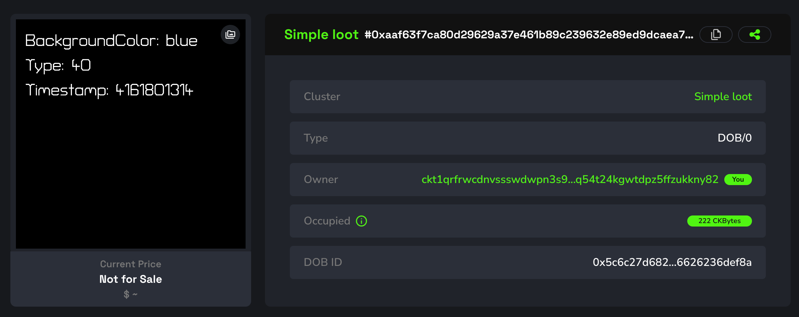
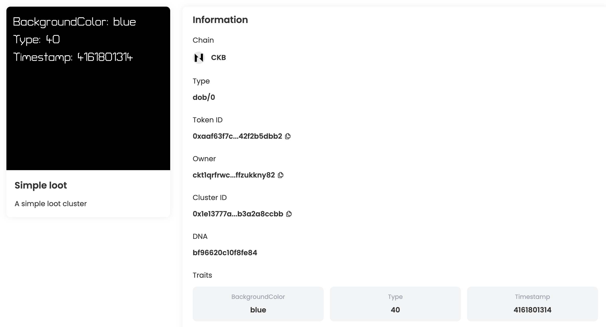
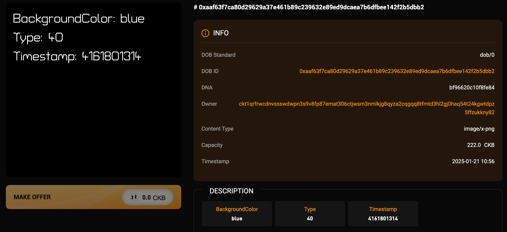
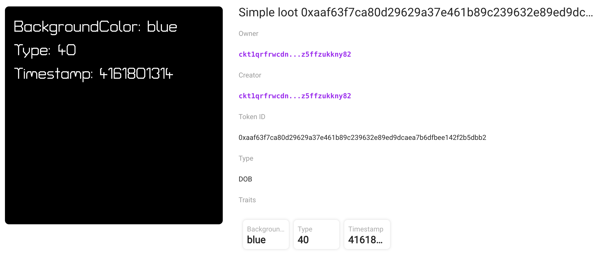

## Intro
This example demonstrates the basic usage of DOB protocol, including creating a cluster and minting a DOB. Afterward, you can view the DOB on JoyID, Omiga, CKB Explorer, Mobit, Dobby. 

<div align="center">
  
</div>

## [Code](./0.basic-loot.ts)

```typescript
import { ccc } from "@ckb-ccc/ccc";
import { client, signer } from "@ckb-ccc/playground";

function getExplorerTxUrl(txHash: string) {
  const isMainnet = client.addressPrefix === 'ckb';
  const baseUrl = isMainnet ? 'https://explorer.nervos.org' : 'https://testnet.explorer.nervos.org';

  return `${baseUrl}/transaction/${txHash}`
}

function generateSimpleDNA(length: number): string {
  return Array.from(
    { length }, 
    () => Math.floor(Math.random() * 16).toString(16)
  ).join('');
}

/**
 * Generate cluster description
 */
function generateClusterDescriptionUnderDobProtocol() {
 
  const clusterDescription = "A simple loot cluster";
  
  const dob0Pattern: ccc.spore.dob.PatternElementDob0[] = [
    {
      traitName: "BackgroundColor",
      dobType: "String",
      dnaOffset: 0,
      dnaLength: 1,
      patternType: "options",
      traitArgs: ["red", "blue", "green", "black", "white"],
    },
    {
      traitName: "Type",
      dobType: "Number",
      dnaOffset: 1,
      dnaLength: 1,
      patternType: "range",
      traitArgs: [10, 50],
    },
    {
      traitName: "Timestamp",
      dobType: "Number",
      dnaOffset: 2,
      dnaLength: 4,
      patternType: "rawNumber",
    },
  ];

  const dob0: ccc.spore.dob.Dob0 = {
    description: clusterDescription,
    dob: {
      ver: 0,
      decoder: ccc.spore.dob.getDecoder(client, "dob0"),
      pattern: dob0Pattern,
    },
  };

  return ccc.spore.dob.encodeClusterDescriptionForDob0(dob0);
}

/**
 * create cluster
 */
const { tx: clusterTx, id: clusterId } = await ccc.spore.createSporeCluster({
  signer,
  data: {
    name: "Simple loot",
    description: generateClusterDescriptionUnderDobProtocol(),
  },
});
await clusterTx.completeFeeBy(signer, 2000n);
const clusterTxHash = await signer.sendTransaction(clusterTx);
console.log("Create cluster tx sent:", clusterTxHash, `Cluster ID: ${clusterId}`);
await signer.client.waitTransaction(clusterTxHash);
console.log("Create cluster tx committed:", getExplorerTxUrl(clusterTxHash), `Cluster ID: ${clusterId}`);


/**
 * create spore
 */
//const clusterId = '0x1e13777a2f098e499137fc7ecede4197e762741113eb21ee14e0f6b3a2a8ccbb';
const { tx: sporeTx, id: sporeId } = await ccc.spore.createSpore({
  signer,
  data: {
    contentType: "dob/0",
    content: ccc.bytesFrom(`{ "dna": "${generateSimpleDNA(16)}" }`, "utf8"),
    clusterId: clusterId,
  },
  clusterMode: "clusterCell",
});
await sporeTx.completeFeeBy(signer, 2000n);
const sporeTxHash = await signer.sendTransaction(sporeTx);
console.log("Mint DOB tx sent:", sporeTxHash, `Spore ID: ${sporeId}`);
await signer.client.waitTransaction(sporeTxHash);
console.log("Mint DOB tx committed:", getExplorerTxUrl(sporeTxHash), `Spore ID: ${sporeId}`);
```

You can also open and edit the code online in [ccc-playground](https://live.ckbccc.com/?src=https://raw.githubusercontent.com/CKBFansDAO/dob-cookbook/refs/heads/main/examples/dob0/0.basic-loot.ts):


## On-chain test cluster and DOB

### Testnet
- 👉[🔗 createCluster tx](testnet.explorer.nervos.org/transaction/0xxxxx)
  - clusterId: `0x1e13777a2f098e499137fc7ecede4197e762741113eb21ee14e0f6b3a2a8ccbb` (type_script.args)
  - clusterTypeHash: `0xfa91828e4085425048e4aeacf7441cb3ebc56b3c6b7a2b77e83066567bf225dd` (hash(type_script(cluster cell)))

- 👉[🔗 mintSpore tx](testnet.explorer.nervos.org/transaction/0xxxxx)
  - sporeId: `0x0xaaf63f7ca80d29629a37e461b89c239632e89ed9dcaea7b6dfbee142f2b5dbb2` (type_script.args)
  - sporeTypeHash: `0x5c6c27d68211837a57d07beee836291eff88700f2121f37f968d6626236def8a` (hash(type_script(spore cell)))

### Mainnet
  Todo.

## Render result (Testnet)

### JoyID

<div align="center">
  
</div>

[View on JoyID](https://testnet.joyid.dev/nft/aaf63f7ca80d29629a37e461b89c239632e89ed9dcaea7b6dfbee142f2b5dbb2) 

### Omiga

<div align="center">
  
</div>

[View on Omiga](https://test.omiga.io/info/dobs/0x5c6c27d68211837a57d07beee836291eff88700f2121f37f968d6626236def8a) 

### Mobit


[View on mobit](https://mobit.app/dob/aaf63f7ca80d29629a37e461b89c239632e89ed9dcaea7b6dfbee142f2b5dbb2?chain=ckb)

### Dobby

[View on Dobby](https://test-dobby.entrust3.com/item-detail_ckb/0xaaf63f7ca80d29629a37e461b89c239632e89ed9dcaea7b6dfbee142f2b5dbb2) 

### Explorer

[View on CKB Explorer](https://testnet.explorer.nervos.org/nft-info/0xfa91828e4085425048e4aeacf7441cb3ebc56b3c6b7a2b77e83066567bf225dd/0xaaf63f7ca80d29629a37e461b89c239632e89ed9dcaea7b6dfbee142f2b5dbb2) 


