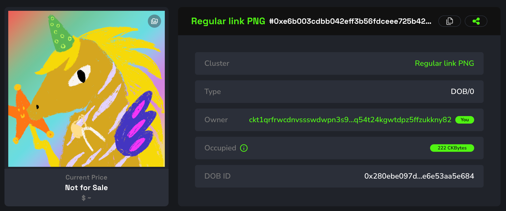
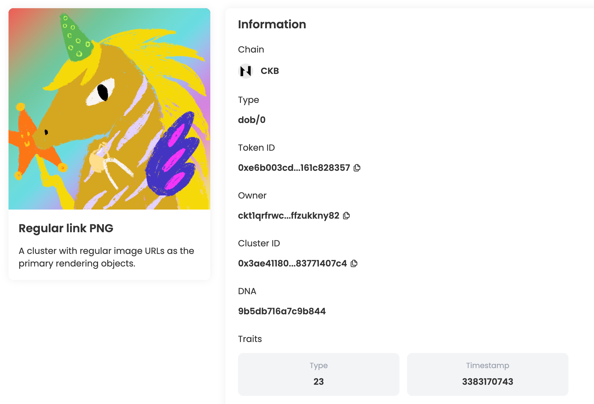
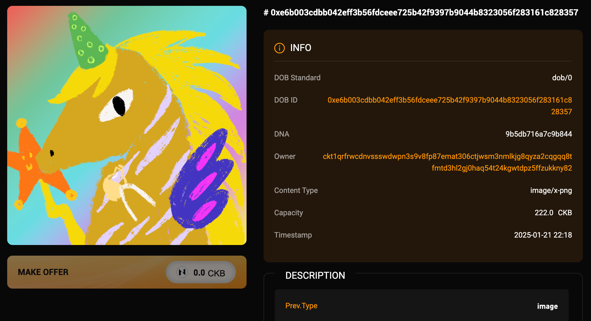
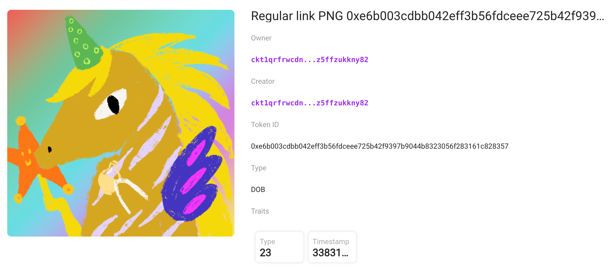

## Intro

This example demonstrates how to create a DOB using the DOB/0 protocol, with regular image URLs as the primary rendering objects. You can view the DOB on JoyID, Omiga, CKB Explorer, Mobit, Dobby. 

<div align="center">
  
</div>

## [Code](./2.regular-link-png.ts)

```typescript
import { ccc } from "@ckb-ccc/ccc";
import { client, signer } from "@ckb-ccc/playground";

function getExplorerTxUrl(txHash: string) {
  const isMainnet = client.addressPrefix === 'ckb';
  const baseUrl = isMainnet ? 'https://explorer.nervos.org' : 'https://testnet.explorer.nervos.org';

  return `${baseUrl}/transaction/${txHash}`
}

function generateSimpleDNA(length: number): string {
  return Array.from(
    { length }, 
    () => Math.floor(Math.random() * 16).toString(16)
  ).join('');
}

/**
 * Generate cluster description
 */
function generateClusterDescriptionUnderDobProtocol() {
 
  const clusterDescription = "A cluster with regular image URLs as the primary rendering objects.";
  
  const dob0Pattern: ccc.spore.dob.PatternElementDob0[] = [
    {
      traitName: "prev.type",
      dobType: "String",
      dnaOffset: 0,
      dnaLength: 1,
      patternType: "options",
      traitArgs: ['image'],
    },
    {
      traitName: "prev.bg",
      dobType: "String",
      dnaOffset: 0,
      dnaLength: 1,
      patternType: "options",
      traitArgs:[
       "https://qzp7in5ts2wbmhobxzavurfjexhnufs2hy2ji4s3blg2wvrwn2ea.akrd.net/hl_0N7OWrBYdwb5BWkSpJc7aFlo-NJRyWwrNq1Y2bog",
      ],
    },
    {
      traitName: "Type",
      dobType: "Number",
      dnaOffset: 1,
      dnaLength: 1,
      patternType: "range",
      traitArgs: [10, 50],
    },
    {
      traitName: "Timestamp",
      dobType: "Number",
      dnaOffset: 2,
      dnaLength: 4,
      patternType: "rawNumber",
    },
  ];

  const dob0: ccc.spore.dob.Dob0 = {
    description: clusterDescription,
    dob: {
      ver: 0,
      decoder: ccc.spore.dob.getDecoder(client, "dob0"),
      pattern: dob0Pattern,
    },
  };

  return ccc.spore.dob.encodeClusterDescriptionForDob0(dob0);
}

/**
 * create cluster
 */
const { tx: clusterTx, id: clusterId } = await ccc.spore.createSporeCluster({
  signer,
  data: {
    name: "Regular link PNG",
    description: generateClusterDescriptionUnderDobProtocol(),
  },
});
await clusterTx.completeFeeBy(signer, 2000n);
const clusterTxHash = await signer.sendTransaction(clusterTx);
console.log("Create cluster tx sent:", clusterTxHash, `Cluster ID: ${clusterId}`);
await signer.client.waitTransaction(clusterTxHash);
console.log("Create cluster tx committed:", getExplorerTxUrl(clusterTxHash), `Cluster ID: ${clusterId}`);

/**
 * create spore
 */
//const clusterId = '0x3ae41180f64a22ad6c73058d27f956f8195c17bab3bc03222b5e5683771407c4';
const { tx: sporeTx, id: sporeId } = await ccc.spore.createSpore({
  signer,
  data: {
    contentType: "dob/0",
    content: ccc.bytesFrom(`{ "dna": "${generateSimpleDNA(16)}" }`, "utf8"),
    clusterId: clusterId,
  },
  clusterMode: "clusterCell",
});
await sporeTx.completeFeeBy(signer, 2000n);
const sporeTxHash = await signer.sendTransaction(sporeTx);
console.log("Mint DOB tx sent:", sporeTxHash, `Spore ID: ${sporeId}`);
await signer.client.waitTransaction(sporeTxHash);
console.log("Mint DOB tx committed:", getExplorerTxUrl(sporeTxHash), `Spore ID: ${sporeId}`);
```

You can also open and edit the code online in [ccc-playground](https://live.ckbccc.com/?src=https://raw.githubusercontent.com/CKBFansDAO/dob-cookbook/refs/heads/main/examples/dob0/2.regular-link-png.ts):


>This example adds two traits to set the background image: `prev.type` and `prev.bg`.
- **`prev.type`** : Render as `image` or `text`.
- **`prev.bg`** : Set the background image.


## On-chain test cluster and DOB

### Testnet
- 👉[🔗 createCluster tx](https://testnet.explorer.nervos.org/transaction/0x922abba3c0d6a6a67b868d3e0c3e11466c9a639508ac38c0963aeb42c7d1dd89)
  - clusterId: `0x3ae41180f64a22ad6c73058d27f956f8195c17bab3bc03222b5e5683771407c4` (type_script.args)
  - clusterTypeHash: `0x8ea60aa94ae49b14e965b4c244576566522f96e93e1fab98c989a88b540f319e` (hash(type_script(cluster cell)))

- 👉[🔗 mintSpore tx](https://testnet.explorer.nervos.org/transaction/0x0038a153f62caee9cbd5dd180509d23201ecc23d0a10c1be088b35b3ec0ed2dc)
  - sporeId: `0xe6b003cdbb042eff3b56fdceee725b42f9397b9044b8323056f283161c828357` (type_script.args)
  - sporeTypeHash: `0x280ebe097d3d804cb51be76f8361fbff827d64697285ab9efb59e6e53aa5e684` (hash(type_script(spore cell)))

### Mainnet
- 👉[🔗 createCluster tx](https://explorer.nervos.org/transaction/0x9a586c14ba5926ba864e809ec05bc2b2ea4f8fa73304cff443cf7e50f42e27b6)
  - clusterId: `0xf9e6cba2730adfca0ee0fe1fccbb8edb64a3af0db29157dbcd8516de36375104` (type_script.args)
  - clusterTypeHash: `0x24f9fb8dbe9f3b7fcd23b1ab2ebe0be07c6e7d99e598dfd70452f8cb5df6fbc9` (hash(type_script(cluster cell)))

- 👉[🔗 mintSpore tx](https://explorer.nervos.org/transaction/0x6a6f57fc8bd8de9acdafe8593031d9561800a55c24b2006624e24b0b727d38c5)
  - sporeId: `0x12cbb27daa19a5a6d1012c64782aef8260d894d837b8522e011e56c4ecd58430` (type_script.args)
  - sporeTypeHash: `0x35017ed709244b36181bf74b46cbc0586071055ba8eb5c116f9a2d4a37591731` (hash(type_script(spore cell)))

## Render result (Testnet)

### JoyID

<div align="center">
  
</div>

[View on JoyID](https://testnet.joyid.dev/nft/e6b003cdbb042eff3b56fdceee725b42f9397b9044b8323056f283161c828357) 

### Omiga



[View on Omiga](https://test.omiga.io/info/dobs/0x82a84fe1975c0d872ea91b8eb3519bdeca275034a25f0b67e21c8a61a1e292bf) 

### Mobit



[View on mobit](https://mobit.app/dob/e6b003cdbb042eff3b56fdceee725b42f9397b9044b8323056f283161c828357?chain=ckb)

### Dobby

[View on Dobby](https://test-dobby.entrust3.com/item-detail_ckb/0xe6b003cdbb042eff3b56fdceee725b42f9397b9044b8323056f283161c828357) 

### Explorer

[View on CKB Explorer](https://testnet.explorer.nervos.org/nft-info/0x8ea60aa94ae49b14e965b4c244576566522f96e93e1fab98c989a88b540f319e/0xe6b003cdbb042eff3b56fdceee725b42f9397b9044b8323056f283161c828357) 


## Compatibility
|         | JoyID | Omiga | CKB Explorer | Mobit | Dobby |
| ------- | ----- | ----- | ------------ | ----- | ----- |
| Testnet | ✅    | ✅     | ✅           | ✅     | ✅    |
| Mainnet | ✅    | ✅     | ✅           | ✅     | ✅    |


---
<div align="right">
  
| [← Previous Example](1.colorful-loot.md) | [Next Example →](3.btcfs-i0-png.md) |
|:-----------------------------------------|------------------------------------:|
</div