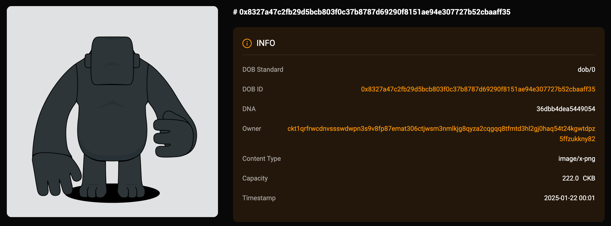

## Intro

This example demonstrates how to create a DOB based on the DOB/0 protocol, using `btcfs://` image links as the primary rendering objects. You can view the DOB on JoyID, Omiga, CKB Explorer, Mobit, Dobby. 

<div align="center">
  
</div>

## [Code](./3.btcfs-i0-png.ts)

```typescript
import { ccc } from "@ckb-ccc/ccc";
import { client, signer } from "@ckb-ccc/playground";

function getExplorerTxUrl(txHash: string) {
  const isMainnet = client.addressPrefix === 'ckb';
  const baseUrl = isMainnet ? 'https://explorer.nervos.org' : 'https://testnet.explorer.nervos.org';

  return `${baseUrl}/transaction/${txHash}`
}

function generateSimpleDNA(length: number): string {
  return Array.from(
    { length }, 
    () => Math.floor(Math.random() * 16).toString(16)
  ).join('');
}

/**
 * Generate cluster description
 */
function generateClusterDescriptionUnderDobProtocol() {
 
  const clusterDescription = "A cluster with btcfs png as the primary rendering objects.";
  
  const dob0Pattern: ccc.spore.dob.PatternElementDob0[] = [
    {
      traitName: "prev.type",
      dobType: "String",
      dnaOffset: 0,
      dnaLength: 1,
      patternType: "options",
      traitArgs: ['image'],
    },
    {
      traitName: "prev.bg",
      dobType: "String",
      dnaOffset: 1,
      dnaLength: 1,
      patternType: "options",
      traitArgs:[
       "btcfs://545b94cb1ecf2175b81c601346e4a7e05149cafc6f235330c9918e35f920e109i0",
      ],
    },
    {
      traitName: "prev.bgcolor",
      dobType: "String",
      dnaOffset: 2,
      dnaLength: 1,
      patternType: "options",
      traitArgs:[
       "#E0E1E2",
      ],
    },
    {
      traitName: "Type",
      dobType: "Number",
      dnaOffset: 3,
      dnaLength: 1,
      patternType: "range",
      traitArgs: [10, 50],
    },
    {
      traitName: "Timestamp",
      dobType: "Number",
      dnaOffset: 4,
      dnaLength: 4,
      patternType: "rawNumber",
    },
  ];

  const dob0: ccc.spore.dob.Dob0 = {
    description: clusterDescription,
    dob: {
      ver: 0,
      decoder: ccc.spore.dob.getDecoder(client, "dob0"),
      pattern: dob0Pattern,
    },
  };

  return ccc.spore.dob.encodeClusterDescriptionForDob0(dob0);
}

/**
 * create cluster
 */
const { tx: clusterTx, id: clusterId } = await ccc.spore.createSporeCluster({
  signer,
  data: {
    name: "BTCFS PNG",
    description: generateClusterDescriptionUnderDobProtocol(),
  },
});
await clusterTx.completeFeeBy(signer, 2000n);
const clusterTxHash = await signer.sendTransaction(clusterTx);
console.log("Create cluster tx sent:", clusterTxHash, `Cluster ID: ${clusterId}`);
await signer.client.waitTransaction(clusterTxHash);
console.log("Create cluster tx committed:", getExplorerTxUrl(clusterTxHash), `Cluster ID: ${clusterId}`);

/**
 * create spore
 */
//const clusterId = '0x4ec09e267a50a2bdee7efa44e1978f416e5ca617b8c392b0027532bf0f7912b2';
const { tx: sporeTx, id: sporeId } = await ccc.spore.createSpore({
  signer,
  data: {
    contentType: "dob/0",
    content: ccc.bytesFrom(`{ "dna": "${generateSimpleDNA(16)}" }`, "utf8"),
    clusterId: clusterId,
  },
  clusterMode: "clusterCell",
});
await sporeTx.completeFeeBy(signer, 2000n);
const sporeTxHash = await signer.sendTransaction(sporeTx);
console.log("Mint DOB tx sent:", sporeTxHash, `Spore ID: ${sporeId}`);
await signer.client.waitTransaction(sporeTxHash);
console.log("Mint DOB tx committed:", getExplorerTxUrl(sporeTxHash), `Spore ID: ${sporeId}`);
```

You can also open and edit the code online in [ccc-playground](https://live.ckbccc.com/?src=https://raw.githubusercontent.com/CKBFansDAO/dob-cookbook/refs/heads/main/examples/dob0/3.btcfs-i0-png.ts):


## On-chain test cluster and DOB

### Testnet
- 👉[🔗 createCluster tx](https://testnet.explorer.nervos.org/transaction/0xc7875c6f604dde5ac2f39c3eff25835c4beb15cfd2254ccab2221962f92690a9)
  - clusterId: `0x4ec09e267a50a2bdee7efa44e1978f416e5ca617b8c392b0027532bf0f7912b2` (type_script.args)
  - clusterTypeHash: `0x808ca210cfd198c7d7d9fbe06a2c399229643eba2c3bdb4acfb8e9173a3635de` (hash(type_script(cluster cell)))

- 👉[🔗 mintSpore tx](https://testnet.explorer.nervos.org/transaction/0xf34375fdf5c6d825c2193b477491cf78bb31a4698246f4087abdc9fa4d890d00)
  - sporeId: `0x8327a47c2fb29d5bcb803f0c37b8787d69290f8151ae94e307727b52cbaaff35` (type_script.args)
  - sporeTypeHash: `0xe0d258a164af075cf311c60d8fd3ce1625f80f56d1b651c192ce4f7d87392e3d` (hash(type_script(spore cell)))

### Mainnet
- 👉[🔗 createCluster tx](https://explorer.nervos.org/transaction/0x52c0f8a515d229ebd61b1191bb54003f847e2ddeb961f51faaec88c47e6a0538)
  - clusterId: `0x20c7db5cb785f2d1f116eda2f09c6b9bf0be8cfc1a3c071e9cd356c8d77d1b9b` (type_script.args)
  - clusterTypeHash: `0x38be255e61b06d66d0d4517deddea4bf4be204915dc151ac3b1c66d4429913fe` (hash(type_script(cluster cell)))

- 👉[🔗 mintSpore tx](https://explorer.nervos.org/transaction/0xa58bc99670a03eabaeecbc1cc4c3320acd40c8714811f9af891205b92c037a45)
  - sporeId: `0xc7a34953593ee0294f7cb1d2a193edc99a47c8fdc617a44f8219eb38c8247cae` (type_script.args)
  - sporeTypeHash: `0x2b25e26779891f2dc1755bec9ae46a4e3557bb91a81057a9a135736a34424416` (hash(type_script(spore cell)))

### Platform Preview(Testnet)

### JoyID

<div align="center">
  
</div>

[View on JoyID](https://testnet.joyid.dev/nft/8327a47c2fb29d5bcb803f0c37b8787d69290f8151ae94e307727b52cbaaff35) 

### Omiga


[View on Omiga](https://test.omiga.io/info/dobs/0xe0d258a164af075cf311c60d8fd3ce1625f80f56d1b651c192ce4f7d87392e3d) 

### Mobit


[View on mobit](https://mobit.app/dob/8327a47c2fb29d5bcb803f0c37b8787d69290f8151ae94e307727b52cbaaff35?chain=ckb)

### Dobby

[View on Dobby(Testnet ❌)](https://test-dobby.entrust3.com/item-detail_ckb/0x8327a47c2fb29d5bcb803f0c37b8787d69290f8151ae94e307727b52cbaaff35) 
[View on Dobby(Mainnet ✅)](https://app.dobby.market/item-detail_ckb/0xc7a34953593ee0294f7cb1d2a193edc99a47c8fdc617a44f8219eb38c8247cae) 

### Explorer

[View on CKB Explorer(Testnet ✅）](https://testnet.explorer.nervos.org/nft-info/0x808ca210cfd198c7d7d9fbe06a2c399229643eba2c3bdb4acfb8e9173a3635de/0x8327a47c2fb29d5bcb803f0c37b8787d69290f8151ae94e307727b52cbaaff35)
[View on CKB Explorer(Mainnet ✅)](https://explorer.nervos.org/nft-info/0x38be255e61b06d66d0d4517deddea4bf4be204915dc151ac3b1c66d4429913fe/0xc7a34953593ee0294f7cb1d2a193edc99a47c8fdc617a44f8219eb38c8247cae)


## Compatibility
|         | JoyID | Omiga | CKB Explorer | Mobit | Dobby |
| ------- | ----- | ----- | ------------ | ----- | ----- |
| Testnet | ✅    | ✅     | ✅           | ✅     | ❌    |
| Mainnet | ✅    | ✅     | ✅           | ✅     | ✅    |


---
<div align="right">
  
| [← Previous Example](2.regular-link-png.md) | [Next Example →](4.ipfs-png.md) |
|:--------------------------------------------|--------------------------------:|
</div