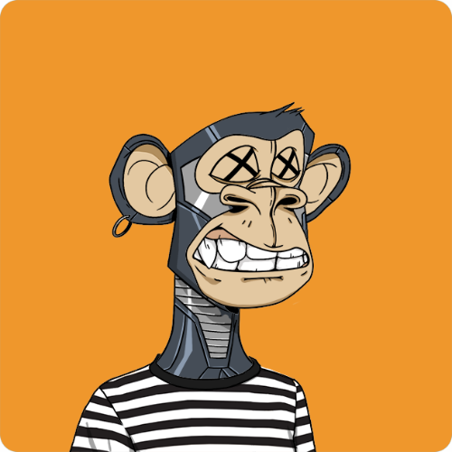
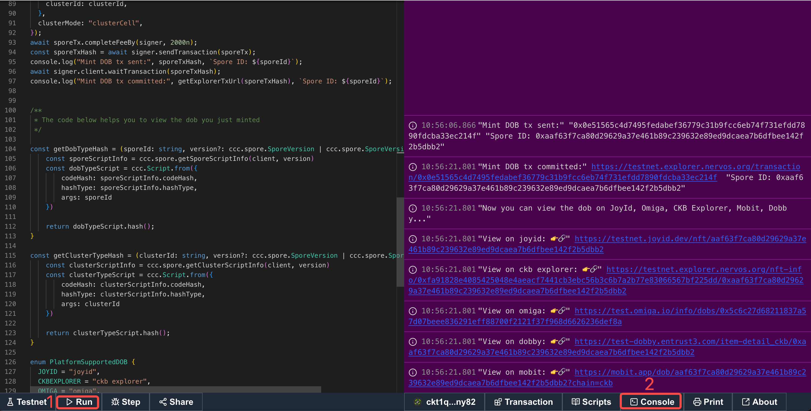
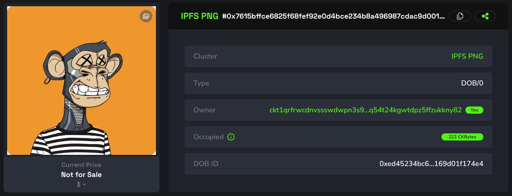
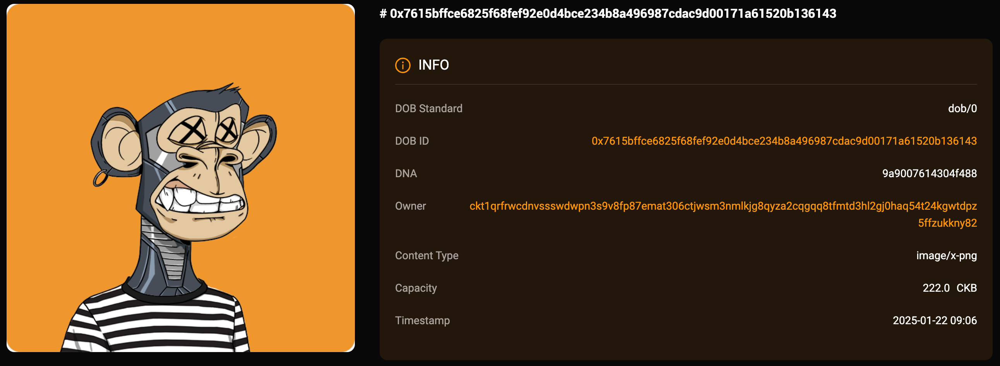
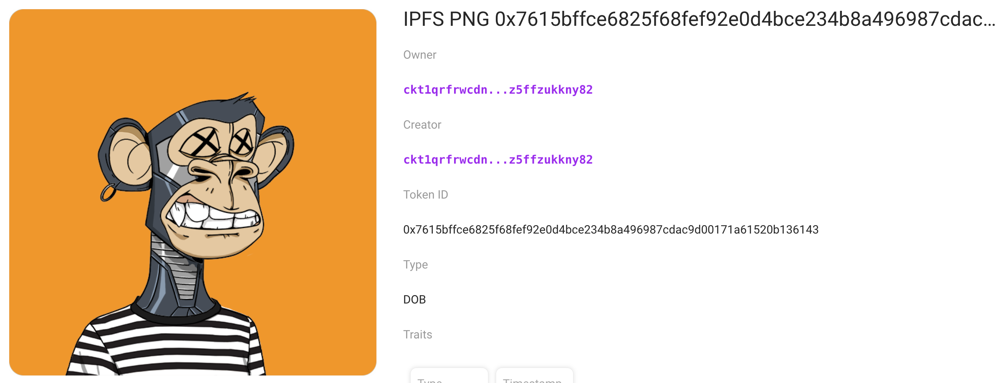

## Intro

This example demonstrates how to create a DOB based on the DOB/0 protocol, using `ipfs://` image links as the primary rendering objects. You can view the DOB on JoyID, Omiga, CKB Explorer, Mobit, Dobby. 

<div align="center">
  
</div>

## [Code](./4.ipfs-png.ts)

```typescript
import { ccc } from "@ckb-ccc/ccc";
import { client, signer } from "@ckb-ccc/playground";

function getExplorerTxUrl(txHash: string) {
  const isMainnet = client.addressPrefix === 'ckb';
  const baseUrl = isMainnet ? 'https://explorer.nervos.org' : 'https://testnet.explorer.nervos.org';

  return `${baseUrl}/transaction/${txHash}`
}

function generateSimpleDNA(length: number): string {
  return Array.from(
    { length }, 
    () => Math.floor(Math.random() * 16).toString(16)
  ).join('');
}

/**
 * Generate cluster description
 */
function generateClusterDescriptionUnderDobProtocol() {
 
  const clusterDescription = "A cluster with ipfs png as the primary rendering objects.";
  
  const dob0Pattern: ccc.spore.dob.PatternElementDob0[] = [
    {
      traitName: "prev.type",
      dobType: "String",
      dnaOffset: 0,
      dnaLength: 1,
      patternType: "options",
      traitArgs: ['image'],
    },
    {
      traitName: "prev.bg",
      dobType: "String",
      dnaOffset: 1,
      dnaLength: 1,
      patternType: "options",
      traitArgs:[
       "ipfs://QmRRPWG96cmgTn2qSzjwr2qvfNEuhunv6FNeMFGa9bx6mQ",
      ],
    },
    {
      traitName: "Type",
      dobType: "Number",
      dnaOffset: 3,
      dnaLength: 1,
      patternType: "range",
      traitArgs: [10, 50],
    },
    {
      traitName: "Timestamp",
      dobType: "Number",
      dnaOffset: 4,
      dnaLength: 4,
      patternType: "rawNumber",
    },
  ];

  const dob0: ccc.spore.dob.Dob0 = {
    description: clusterDescription,
    dob: {
      ver: 0,
      decoder: ccc.spore.dob.getDecoder(client, "dob0"),
      pattern: dob0Pattern,
    },
  };

  return ccc.spore.dob.encodeClusterDescriptionForDob0(dob0);
}

/**
 * create cluster
 */
const { tx: clusterTx, id: clusterId } = await ccc.spore.createSporeCluster({
  signer,
  data: {
    name: "IPFS PNG",
    description: generateClusterDescriptionUnderDobProtocol(),
  },
});
await clusterTx.completeFeeBy(signer, 2000n);
const clusterTxHash = await signer.sendTransaction(clusterTx);
console.log("Create cluster tx sent:", clusterTxHash, `Cluster ID: ${clusterId}`);
await signer.client.waitTransaction(clusterTxHash);
console.log("Create cluster tx committed:", getExplorerTxUrl(clusterTxHash), `Cluster ID: ${clusterId}`);

/**
 * create spore
 */
//const clusterId = '0x63667a454c67ae31ad9acca4ad5798004eb62fbc047dceee6913c8c5fca91e91';
const { tx: sporeTx, id: sporeId } = await ccc.spore.createSpore({
  signer,
  data: {
    contentType: "dob/0",
    content: ccc.bytesFrom(`{ "dna": "${generateSimpleDNA(16)}" }`, "utf8"),
    clusterId: clusterId,
  },
  clusterMode: "clusterCell",
});
await sporeTx.completeFeeBy(signer, 2000n);
const sporeTxHash = await signer.sendTransaction(sporeTx);
console.log("Mint DOB tx sent:", sporeTxHash, `Spore ID: ${sporeId}`);
await signer.client.waitTransaction(sporeTxHash);
console.log("Mint DOB tx committed:", getExplorerTxUrl(sporeTxHash), `Spore ID: ${sporeId}`);
```

You can also open and edit the code online in [ccc-playground](https://live.ckbccc.com/?src=https://raw.githubusercontent.com/CKBFansDAO/dob-cookbook/refs/heads/main/examples/dob0/4.ipfs-png.ts):




## On-chain test cluster and DOB

### Testnet
- 👉[🔗 createCluster tx](https://testnet.explorer.nervos.org/transaction/0xcf50c8cbc31f9c196e7839c705433991d43a7e0cd71f7f2a89596df33e35608c)
  - clusterId: `0x63667a454c67ae31ad9acca4ad5798004eb62fbc047dceee6913c8c5fca91e91` (type_script.args)
  - clusterTypeHash: `0x17469eda1b649ed47da7d8c762baa6368ad6cbb44a0c34add556cf577172ae25` (hash(type_script(cluster cell)))

- 👉[🔗 mintSpore tx](https://testnet.explorer.nervos.org/transaction/0xa5e208b2e40200daa6bdf0d82f7161593d6ae35dd4f6c705294c49588c17f46b)
  - sporeId: `0x7615bffce6825f68fef92e0d4bce234b8a496987cdac9d00171a61520b136143` (type_script.args)
  - sporeTypeHash: `0xe0d258a164af075cf311c60d8fd3ce1625f80f56d1b651c192ce4f7d87392e3d` (hash(type_script(spore cell)))

### Mainnet
  Todo.

## Render result (Testnet)

### JoyID

<div align="center">
  
</div>

[View on JoyID](https://testnet.joyid.dev/nft/7615bffce6825f68fef92e0d4bce234b8a496987cdac9d00171a61520b136143) 

### Omiga



[View on Omiga](https://test.omiga.io/info/dobs/0xe0d258a164af075cf311c60d8fd3ce1625f80f56d1b651c192ce4f7d87392e3d) 

### Mobit


[View on mobit](https://mobit.app/dob/7615bffce6825f68fef92e0d4bce234b8a496987cdac9d00171a61520b136143?chain=ckb)

### Dobby

[View on Dobby](https://test-dobby.entrust3.com/item-detail_ckb/0x7615bffce6825f68fef92e0d4bce234b8a496987cdac9d00171a61520b136143) 

### Explorer

[View on CKB Explorer](https://testnet.explorer.nervos.org/nft-info/0x17469eda1b649ed47da7d8c762baa6368ad6cbb44a0c34add556cf577172ae25/0x7615bffce6825f68fef92e0d4bce234b8a496987cdac9d00171a61520b136143) 


## Compatibility
|         | JoyID | Omiga | CKB Explorer | Mobit | Dobby |
| ------- | ----- | ----- | ------------ | ----- | ----- |
| Testnet | ✅    | ✅     | ✅           | ✅     | ❌    |
| Mainnet |     |     |           |    |     |


<div style="display: flex; justify-content: space-between; padding: 10px;">
  <a href="3.btcfs-i0-png.md">← Previous Example</a>
  <a href="5.regular-link-svg.md">Next Example →</a>
</div>