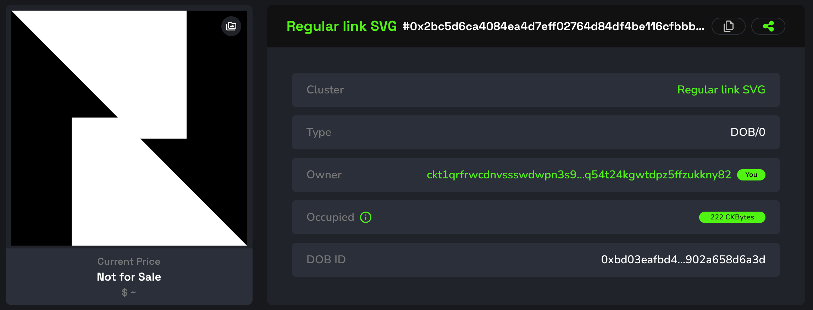
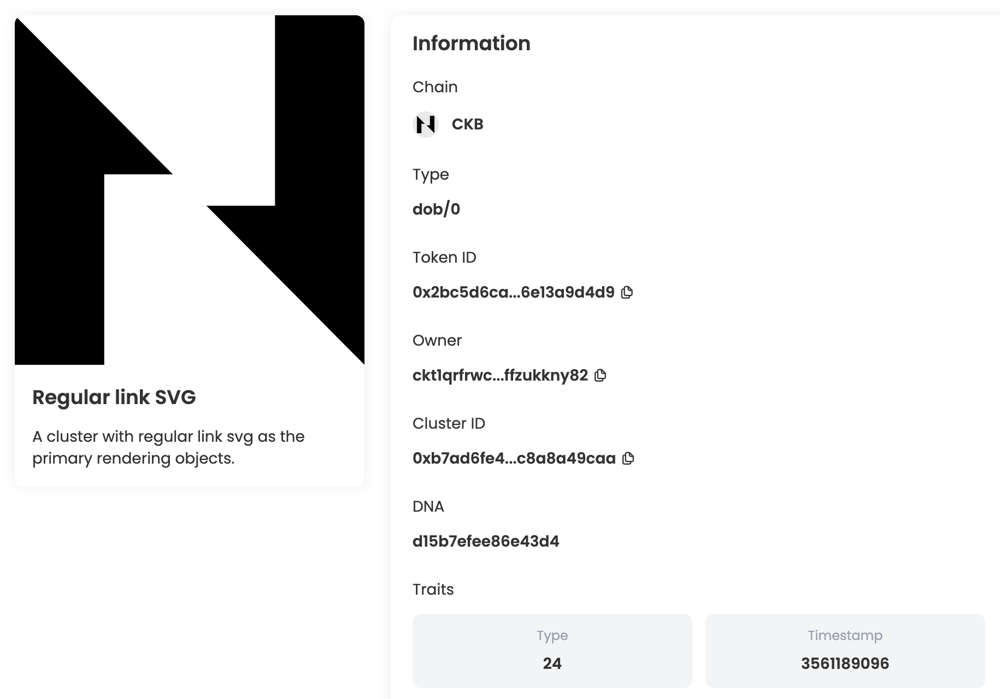
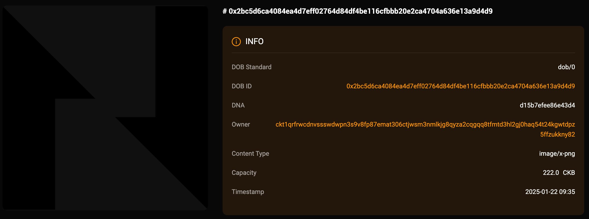
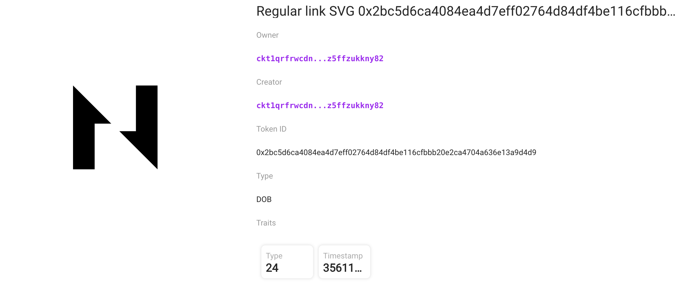

## Intro

This example demonstrates how to create a DOB using the DOB/0 protocol, with regular image URLs as the primary rendering objects. You can view the DOB on JoyID, Omiga, CKB Explorer, Mobit, Dobby. 

<div align="center">
  
</div>

## [Code](./5.regular-link-svg.ts)

```typescript
import { ccc } from "@ckb-ccc/ccc";
import { client, signer } from "@ckb-ccc/playground";

function getExplorerTxUrl(txHash: string) {
  const isMainnet = client.addressPrefix === 'ckb';
  const baseUrl = isMainnet ? 'https://explorer.nervos.org' : 'https://testnet.explorer.nervos.org';

  return `${baseUrl}/transaction/${txHash}`
}

function generateSimpleDNA(length: number): string {
  return Array.from(
    { length }, 
    () => Math.floor(Math.random() * 16).toString(16)
  ).join('');
}

/**
 * Generate cluster description
 */
function generateClusterDescriptionUnderDobProtocol() {
 
  const clusterDescription = "A cluster with regular link svg as the primary rendering objects.";
  
  const dob0Pattern: ccc.spore.dob.PatternElementDob0[] = [
    {
      traitName: "prev.type",
      dobType: "String",
      dnaOffset: 0,
      dnaLength: 1,
      patternType: "options",
      traitArgs: ['image'],
    },
    {
      traitName: "prev.bg",
      dobType: "String",
      dnaOffset: 1,
      dnaLength: 1,
      patternType: "options",
      traitArgs:[
       "https://www.nervos.org/favicon.svg",
      ],
    },
    {
      traitName: "Type",
      dobType: "Number",
      dnaOffset: 3,
      dnaLength: 1,
      patternType: "range",
      traitArgs: [10, 50],
    },
    {
      traitName: "Timestamp",
      dobType: "Number",
      dnaOffset: 4,
      dnaLength: 4,
      patternType: "rawNumber",
    },
  ];

  const dob0: ccc.spore.dob.Dob0 = {
    description: clusterDescription,
    dob: {
      ver: 0,
      decoder: ccc.spore.dob.getDecoder(client, "dob0"),
      pattern: dob0Pattern,
    },
  };

  return ccc.spore.dob.encodeClusterDescriptionForDob0(dob0);
}

/**
 * create cluster
 */
const { tx: clusterTx, id: clusterId } = await ccc.spore.createSporeCluster({
  signer,
  data: {
    name: "Regular link SVG",
    description: generateClusterDescriptionUnderDobProtocol(),
  },
});
await clusterTx.completeFeeBy(signer, 2000n);
const clusterTxHash = await signer.sendTransaction(clusterTx);
console.log("Create cluster tx sent:", clusterTxHash, `Cluster ID: ${clusterId}`);
await signer.client.waitTransaction(clusterTxHash);
console.log("Create cluster tx committed:", getExplorerTxUrl(clusterTxHash), `Cluster ID: ${clusterId}`);

/**
 * create spore
 */
//const clusterId = '0x3ae41180f64a22ad6c73058d27f956f8195c17bab3bc03222b5e5683771407c4';
const { tx: sporeTx, id: sporeId } = await ccc.spore.createSpore({
  signer,
  data: {
    contentType: "dob/0",
    content: ccc.bytesFrom(`{ "dna": "${generateSimpleDNA(16)}" }`, "utf8"),
    clusterId: clusterId,
  },
  clusterMode: "clusterCell",
});
await sporeTx.completeFeeBy(signer, 2000n);
const sporeTxHash = await signer.sendTransaction(sporeTx);
console.log("Mint DOB tx sent:", sporeTxHash, `Spore ID: ${sporeId}`);
await signer.client.waitTransaction(sporeTxHash);
console.log("Mint DOB tx committed:", getExplorerTxUrl(sporeTxHash), `Spore ID: ${sporeId}`);
```

You can also open and edit the code online in [ccc-playground](https://live.ckbccc.com/?src=https://raw.githubusercontent.com/CKBFansDAO/dob-cookbook/refs/heads/main/examples/dob0/5.regular-link-svg.ts):


>This example adds two traits to set the background image: `prev.type` and `prev.bg`.
- **`prev.type`** : Render as `image` or `text`.
- **`prev.bg`** : Set the background image.


## On-chain test cluster and DOB

### Testnet
- 👉[🔗 createCluster tx](https://testnet.explorer.nervos.org/transaction/0x20129fa511e7e2ceaa6491e8a6f83b75db4558a083601a21a0897a97cd23f135)
  - clusterId: `0x3ae41180f64a22ad6c73058d27f956f8195c17bab3bc03222b5e5683771407c4` (type_script.args)
  - clusterTypeHash: `0x574c7a019d7cbb584e2f75ed69f69047de6a2dd1b0fb2da3b1153c11155ce12a` (hash(type_script(cluster cell)))

- 👉[🔗 mintSpore tx](https://testnet.explorer.nervos.org/transaction/0x8d355897d8e907933cdaa7448f1f8ba10aa412c69b58ebe7dc151ae5867ead26)
  - sporeId: `0x2bc5d6ca4084ea4d7eff02764d84df4be116cfbbb20e2ca4704a636e13a9d4d9` (type_script.args)
  - sporeTypeHash: `0x280ebe097d3d804cb51be76f8361fbff827d64697285ab9efb59e6e53aa5e684` (hash(type_script(spore cell)))

### Mainnet
  Todo.

## Render result (Testnet)

### JoyID

<div align="center">
  
</div>

[View on JoyID](https://testnet.joyid.dev/nft/2bc5d6ca4084ea4d7eff02764d84df4be116cfbbb20e2ca4704a636e13a9d4d9) 

### Omiga



[View on Omiga](https://test.omiga.io/info/dobs/0x82a84fe1975c0d872ea91b8eb3519bdeca275034a25f0b67e21c8a61a1e292bf) 

### Mobit



[View on mobit](https://mobit.app/dob/2bc5d6ca4084ea4d7eff02764d84df4be116cfbbb20e2ca4704a636e13a9d4d9?chain=ckb)

### Dobby

[View on Dobby](https://test-dobby.entrust3.com/item-detail_ckb/0x2bc5d6ca4084ea4d7eff02764d84df4be116cfbbb20e2ca4704a636e13a9d4d9) 

### Explorer

[View on CKB Explorer](https://testnet.explorer.nervos.org/nft-info/0x574c7a019d7cbb584e2f75ed69f69047de6a2dd1b0fb2da3b1153c11155ce12a/0x2bc5d6ca4084ea4d7eff02764d84df4be116cfbbb20e2ca4704a636e13a9d4d9) 


## Compatibility
|         | JoyID | Omiga | CKB Explorer | Mobit | Dobby |
| ------- | ----- | ----- | ------------ | ----- | ----- |
| Testnet | ✅    | ✅     | ✅           | ✅     | ✅    |
| Mainnet |     |     |           |    |     |


---
<div align="right">
  
| [← Previous Example](4.ipfs-png.md) | [Next Example →](6.btcfs-i0-svg.md) |
|:------------------------------------|------------------------------------:|
</div