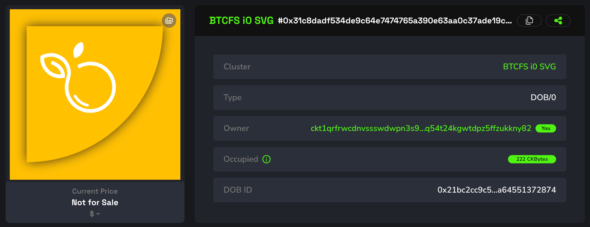
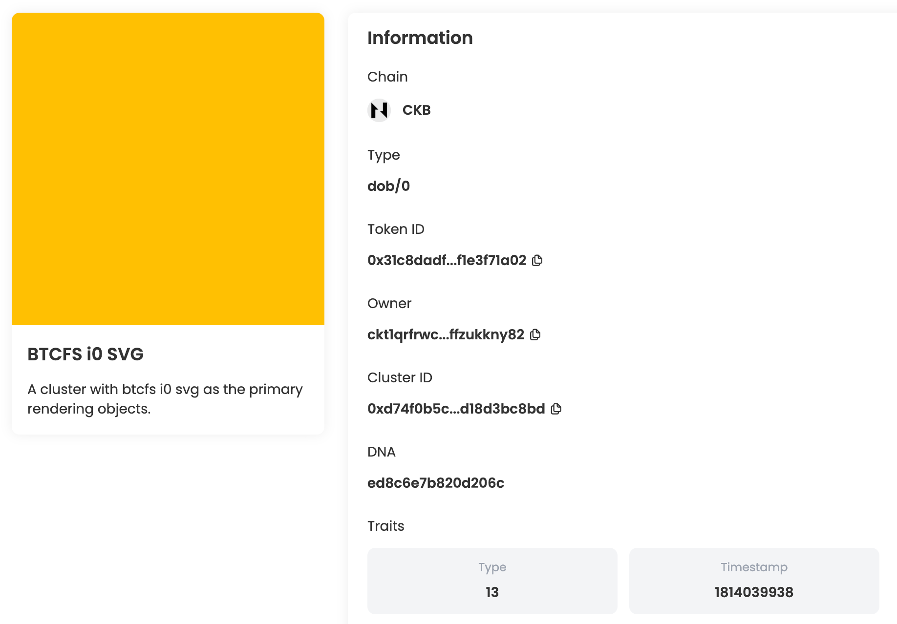
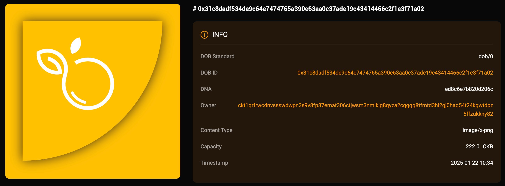
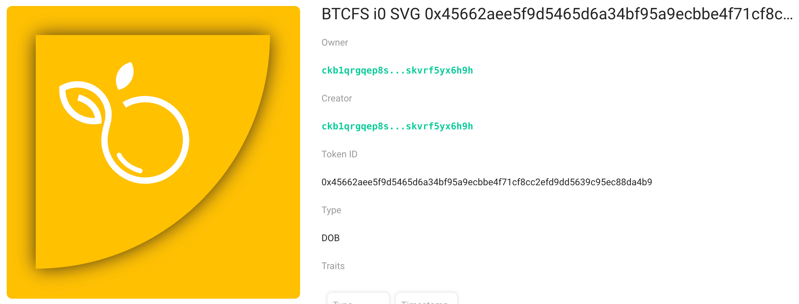

## Intro

This example demonstrates how to create a DOB based on the DOB/0 protocol, using `btcfs://{BTCTX_ID}i0` svg image links as the primary rendering objects. You can view the DOB on JoyID, Omiga, CKB Explorer, Mobit, Dobby. 

<div align="center">
  
</div>

## [Code](./6.btcfs-i0-svg.ts)

```typescript
import { ccc } from "@ckb-ccc/ccc";
import { client, signer } from "@ckb-ccc/playground";

function getExplorerTxUrl(txHash: string) {
  const isMainnet = client.addressPrefix === 'ckb';
  const baseUrl = isMainnet ? 'https://explorer.nervos.org' : 'https://testnet.explorer.nervos.org';

  return `${baseUrl}/transaction/${txHash}`
}

function generateSimpleDNA(length: number): string {
  return Array.from(
    { length }, 
    () => Math.floor(Math.random() * 16).toString(16)
  ).join('');
}

/**
 * Generate cluster description
 */
function generateClusterDescriptionUnderDobProtocol() {
 
  const clusterDescription = "A cluster with btcfs i0 svg as the primary rendering objects.";
  
  const dob0Pattern: ccc.spore.dob.PatternElementDob0[] = [
    {
      traitName: "prev.type",
      dobType: "String",
      dnaOffset: 0,
      dnaLength: 1,
      patternType: "options",
      traitArgs: ['image'],
    },
    {
      traitName: "prev.bg",
      dobType: "String",
      dnaOffset: 1,
      dnaLength: 1,
      patternType: "options",
      traitArgs:[
       "btcfs://8ca2da44996f5a06ad44b5bb87fd9acb71390b6c0cb1910c10b0deb8daad7f82i0",
      ],
    },
    {
      traitName: "prev.bgcolor",
      dobType: "String",
      dnaOffset: 2,
      dnaLength: 1,
      patternType: "options",
      traitArgs:[
       "#FFC103",
      ],
    },
    {
      traitName: "Type",
      dobType: "Number",
      dnaOffset: 3,
      dnaLength: 1,
      patternType: "range",
      traitArgs: [10, 50],
    },
    {
      traitName: "Timestamp",
      dobType: "Number",
      dnaOffset: 4,
      dnaLength: 4,
      patternType: "rawNumber",
    },
  ];

  const dob0: ccc.spore.dob.Dob0 = {
    description: clusterDescription,
    dob: {
      ver: 0,
      decoder: ccc.spore.dob.getDecoder(client, "dob0"),
      pattern: dob0Pattern,
    },
  };

  return ccc.spore.dob.encodeClusterDescriptionForDob0(dob0);
}

/**
 * create cluster
 */
const { tx: clusterTx, id: clusterId } = await ccc.spore.createSporeCluster({
  signer,
  data: {
    name: "BTCFS i0 SVG",
    description: generateClusterDescriptionUnderDobProtocol(),
  },
});
await clusterTx.completeFeeBy(signer, 2000n);
const clusterTxHash = await signer.sendTransaction(clusterTx);
console.log("Create cluster tx sent:", clusterTxHash, `Cluster ID: ${clusterId}`);
await signer.client.waitTransaction(clusterTxHash);
console.log("Create cluster tx committed:", getExplorerTxUrl(clusterTxHash), `Cluster ID: ${clusterId}`);

/**
 * create spore
 */
//const clusterId = '0xd74f0b5c866f0f04958426213781ddb80e9cd730c78d24f7c149aad18d3bc8bd';
const { tx: sporeTx, id: sporeId } = await ccc.spore.createSpore({
  signer,
  data: {
    contentType: "dob/0",
    content: ccc.bytesFrom(`{ "dna": "${generateSimpleDNA(16)}" }`, "utf8"),
    clusterId: clusterId,
  },
  clusterMode: "clusterCell",
});
await sporeTx.completeFeeBy(signer, 2000n);
const sporeTxHash = await signer.sendTransaction(sporeTx);
console.log("Mint DOB tx sent:", sporeTxHash, `Spore ID: ${sporeId}`);
await signer.client.waitTransaction(sporeTxHash);
console.log("Mint DOB tx committed:", getExplorerTxUrl(sporeTxHash), `Spore ID: ${sporeId}`);

```

You can also open and edit the code online in [ccc-playground](https://live.ckbccc.com/?src=https://raw.githubusercontent.com/CKBFansDAO/dob-cookbook/refs/heads/main/examples/dob0/6.btcfs-i0-svg.ts):


## On-chain test cluster and DOB

### Testnet
- 👉[🔗 createCluster tx](https://testnet.explorer.nervos.org/transaction/0x17e720fd2af095f6a1d1264ca5aacff3edd9a22adf4410ee6ab2138cd3ac9221)
  - clusterId: `0xd74f0b5c866f0f04958426213781ddb80e9cd730c78d24f7c149aad18d3bc8bd` (type_script.args)
  - clusterTypeHash: `0xfb54bf0dd2e6e0afad1b1cab49f83645c69d066d9b6554984ce573ecd640835d` (hash(type_script(cluster cell)))

- 👉[🔗 mintSpore tx](https://testnet.explorer.nervos.org/transaction/0xf34375fdf5c6d825c2193b477491cf78bb31a4698246f4087abdc9fa4d890d00)
  - sporeId: `0x31c8dadf534de9c64e7474765a390e63aa0c37ade19c43414466c2f1e3f71a02` (type_script.args)
  - sporeTypeHash: `0x21bc2cc9c5c90f4952746ce0025a84b66ea6a13710bb4dddeb3fa64551372874` (hash(type_script(spore cell)))

### Mainnet
- 👉[🔗 createCluster tx](https://explorer.nervos.org/transaction/0xe565f42c25ae01a9cf5f4bd2418516697e8f47d1f4565860950cd178b5073c67)
  - clusterId: `0xf921cda6dddff8824548194981790a0c4bf94e451510be5fc09cc582e9f2aca0` (type_script.args)
  - clusterTypeHash: `0x5c99ff530822918d9c34debeef261931c7a8f4283cf661163b22178b09a9c058` (hash(type_script(cluster cell)))

- 👉[🔗 mintSpore tx](https://explorer.nervos.org/transaction/0x70d364b6bc2d83b26026b56de9ae70618f257224e582906aaaccfb022c216837)
  - sporeId: `0x45662aee5f9d5465d6a34bf95a9ecbbe4f71cf8cc2efd9dd5639c95ec88da4b9` (type_script.args)
  - sporeTypeHash: `0xcf1b24b67db28eb46ff70ba694e7224cde2304f807f4cc01b085e5824305d7ca` (hash(type_script(spore cell)))

### Platform Preview(Testnet)

### JoyID

<div align="center">
  
</div>

[View on JoyID](https://testnet.joyid.dev/nft/31c8dadf534de9c64e7474765a390e63aa0c37ade19c43414466c2f1e3f71a02) 

### Omiga



[View on Omiga](https://test.omiga.io/info/dobs/0x21bc2cc9c5c90f4952746ce0025a84b66ea6a13710bb4dddeb3fa64551372874) 

### Mobit



[View on mobit](https://mobit.app/dob/31c8dadf534de9c64e7474765a390e63aa0c37ade19c43414466c2f1e3f71a02?chain=ckb)

### Dobby

[View on Dobby(Testnet ❌）](https://test-dobby.entrust3.com/item-detail_ckb/0x31c8dadf534de9c64e7474765a390e63aa0c37ade19c43414466c2f1e3f71a02) 
[View on Dobby(Mainnet ✅)](https://app.dobby.market/item-detail_ckb/0x45662aee5f9d5465d6a34bf95a9ecbbe4f71cf8cc2efd9dd5639c95ec88da4b9) 

### Explorer

[View on CKB Explorer (Testnet ❌)](https://testnet.explorer.nervos.org/nft-info/0xfb54bf0dd2e6e0afad1b1cab49f83645c69d066d9b6554984ce573ecd640835d/0x31c8dadf534de9c64e7474765a390e63aa0c37ade19c43414466c2f1e3f71a02) 

[View on CKB Explorer (Mainnet ✅)](https://explorer.nervos.org/nft-info/0x5c99ff530822918d9c34debeef261931c7a8f4283cf661163b22178b09a9c058/0x45662aee5f9d5465d6a34bf95a9ecbbe4f71cf8cc2efd9dd5639c95ec88da4b9)


## Compatibility
|         | JoyID | Omiga | CKB Explorer | Mobit | Dobby |
| ------- | ----- | ----- | ------------ | ----- | ----- |
| Testnet | ✅    | ✅     | ❌           | ✅     | ❌    |
| Mainnet | ✅    | ✅     | ✅           | ✅     | ✅    |


---
<div align="right">
  
| [← Previous Example](5.regular-link-svg.md) | [Next Example →](7.btcfs-i1-png.md) |
|:--------------------------------------------|------------------------------------:|
</div