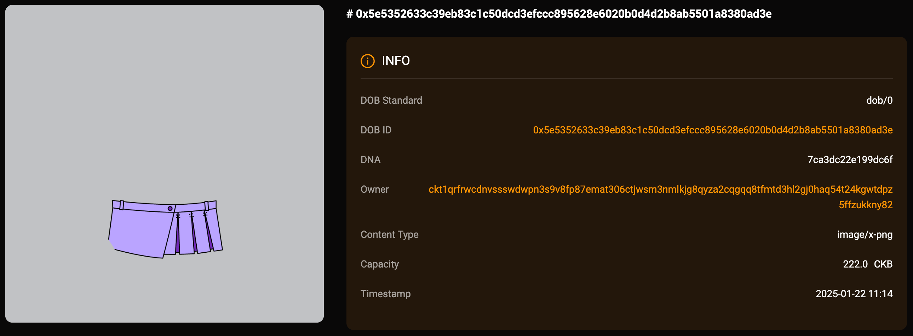

## Intro

This example demonstrates how to create a DOB based on the DOB/0 protocol, using `btcfs://{BTCTX_ID}i1` png image links as the primary rendering objects. You can view the DOB on JoyID, Omiga, CKB Explorer, Mobit, Dobby. 

<div align="center">
  
</div>

## [Code](./7.btcfs-i1-png.ts)

```typescript
import { ccc } from "@ckb-ccc/ccc";
import { client, signer } from "@ckb-ccc/playground";

function getExplorerTxUrl(txHash: string) {
  const isMainnet = client.addressPrefix === 'ckb';
  const baseUrl = isMainnet ? 'https://explorer.nervos.org' : 'https://testnet.explorer.nervos.org';

  return `${baseUrl}/transaction/${txHash}`
}

function generateSimpleDNA(length: number): string {
  return Array.from(
    { length }, 
    () => Math.floor(Math.random() * 16).toString(16)
  ).join('');
}

/**
 * Generate cluster description
 */
function generateClusterDescriptionUnderDobProtocol() {
 
  const clusterDescription = "A cluster with btcfs i1 png as the primary rendering objects.";
  
  const dob0Pattern: ccc.spore.dob.PatternElementDob0[] = [
    {
      traitName: "prev.type",
      dobType: "String",
      dnaOffset: 0,
      dnaLength: 1,
      patternType: "options",
      traitArgs: ['image'],
    },
    {
      traitName: "prev.bg",
      dobType: "String",
      dnaOffset: 1,
      dnaLength: 1,
      patternType: "options",
      traitArgs:[
       "btcfs://3bb2e97555eb1c54f379bcac51a201a18882188fb4c5e7b3aeed566088172f01i1",
      ],
    },
    {
      traitName: "prev.bgcolor",
      dobType: "String",
      dnaOffset: 2,
      dnaLength: 1,
      patternType: "options",
      traitArgs:[
       "#C1C2C5",
      ],
    },
    {
      traitName: "Type",
      dobType: "Number",
      dnaOffset: 3,
      dnaLength: 1,
      patternType: "range",
      traitArgs: [10, 50],
    },
    {
      traitName: "Timestamp",
      dobType: "Number",
      dnaOffset: 4,
      dnaLength: 4,
      patternType: "rawNumber",
    },
  ];

  const dob0: ccc.spore.dob.Dob0 = {
    description: clusterDescription,
    dob: {
      ver: 0,
      decoder: ccc.spore.dob.getDecoder(client, "dob0"),
      pattern: dob0Pattern,
    },
  };

  return ccc.spore.dob.encodeClusterDescriptionForDob0(dob0);
}

/**
 * create cluster
 */
const { tx: clusterTx, id: clusterId } = await ccc.spore.createSporeCluster({
  signer,
  data: {
    name: "BTCFS i1 PNG",
    description: generateClusterDescriptionUnderDobProtocol(),
  },
});
await clusterTx.completeFeeBy(signer, 2000n);
const clusterTxHash = await signer.sendTransaction(clusterTx);
console.log("Create cluster tx sent:", clusterTxHash, `Cluster ID: ${clusterId}`);
await signer.client.waitTransaction(clusterTxHash);
console.log("Create cluster tx committed:", getExplorerTxUrl(clusterTxHash), `Cluster ID: ${clusterId}`);

/**
 * create spore
 */
//const clusterId = '0xa0af382231f3b48d92cd76d974e83df95c950269ea3257ffcadc49ba610ba980';
const { tx: sporeTx, id: sporeId } = await ccc.spore.createSpore({
  signer,
  data: {
    contentType: "dob/0",
    content: ccc.bytesFrom(`{ "dna": "${generateSimpleDNA(16)}" }`, "utf8"),
    clusterId: clusterId,
  },
  clusterMode: "clusterCell",
});
await sporeTx.completeFeeBy(signer, 2000n);
const sporeTxHash = await signer.sendTransaction(sporeTx);
console.log("Mint DOB tx sent:", sporeTxHash, `Spore ID: ${sporeId}`);
await signer.client.waitTransaction(sporeTxHash);
console.log("Mint DOB tx committed:", getExplorerTxUrl(sporeTxHash), `Spore ID: ${sporeId}`);

```

You can also open and edit the code online in [ccc-playground](https://live.ckbccc.com/?src=https://raw.githubusercontent.com/CKBFansDAO/dob-cookbook/refs/heads/main/examples/dob0/7.btcfs-i1-png.ts):


## On-chain test cluster and DOB

### Testnet
- 👉[🔗 createCluster tx](https://testnet.explorer.nervos.org/transaction/0x273aa105cfb4587d3ae6f98e3e7f47d79342c0d5d001bd5f7ae50114a8153899)
  - clusterId: `0xa0af382231f3b48d92cd76d974e83df95c950269ea3257ffcadc49ba610ba980` (type_script.args)
  - clusterTypeHash: `0x7af6cf32930d8489abbdf18969fd98a7801c847f998ed6ea3bc6f2bfc052ef1e` (hash(type_script(cluster cell)))

- 👉[🔗 mintSpore tx](https://testnet.explorer.nervos.org/transaction/0xeca8e2b3bf82f12edd753fe659686dd8231310e81f0120334e61985c6adf7d3c)
  - sporeId: `0x5e5352633c39eb83c1c50dcd3efccc895628e6020b0d4d2b8ab5501a8380ad3e` (type_script.args)
  - sporeTypeHash: `0x4b65c72e5eb6964744024d150ddf060c31443c46dfbd5885890a710f6213e2c2` (hash(type_script(spore cell)))

### Mainnet
  Todo.

## Render result (Testnet)

### JoyID

<div align="center">
  
</div>

[View on JoyID](https://testnet.joyid.dev/nft/5e5352633c39eb83c1c50dcd3efccc895628e6020b0d4d2b8ab5501a8380ad3e) 

### Omiga


[View on Omiga](https://test.omiga.io/info/dobs/0x4b65c72e5eb6964744024d150ddf060c31443c46dfbd5885890a710f6213e2c2) 

### Mobit


[View on mobit](https://mobit.app/dob/5e5352633c39eb83c1c50dcd3efccc895628e6020b0d4d2b8ab5501a8380ad3e?chain=ckb)

### Dobby

[View on Dobby](https://test-dobby.entrust3.com/item-detail_ckb/0x5e5352633c39eb83c1c50dcd3efccc895628e6020b0d4d2b8ab5501a8380ad3e) 

### Explorer

[View on CKB Explorer](https://testnet.explorer.nervos.org/nft-info/0x7af6cf32930d8489abbdf18969fd98a7801c847f998ed6ea3bc6f2bfc052ef1e/0x5e5352633c39eb83c1c50dcd3efccc895628e6020b0d4d2b8ab5501a8380ad3e) 


## Compatibility
|         | JoyID | Omiga | CKB Explorer | Mobit | Dobby |
| ------- | ----- | ----- | ------------ | ----- | ----- |
| Testnet | ✅    | ✅     | ❌           | ✅     | ❌    |
| Mainnet |     |     |           |    |     |