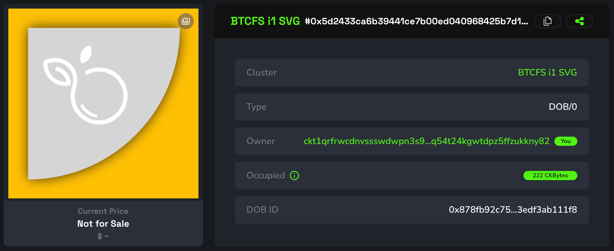
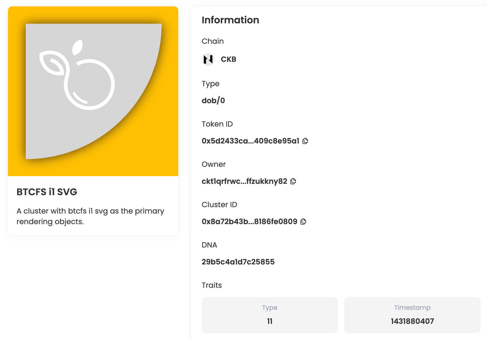
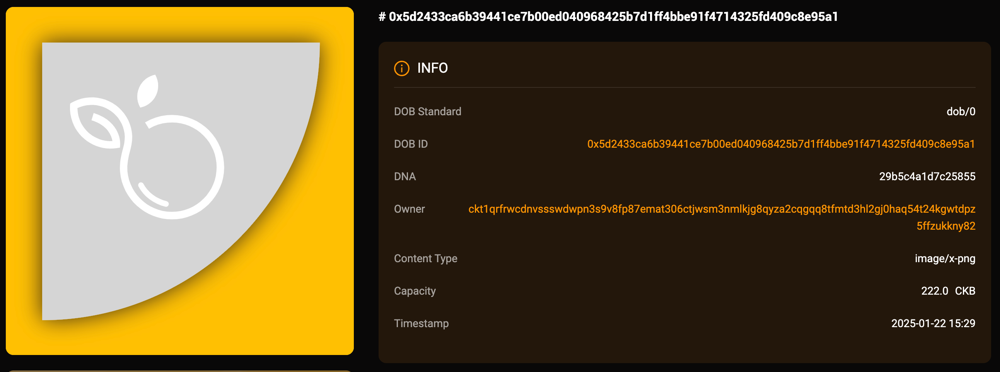
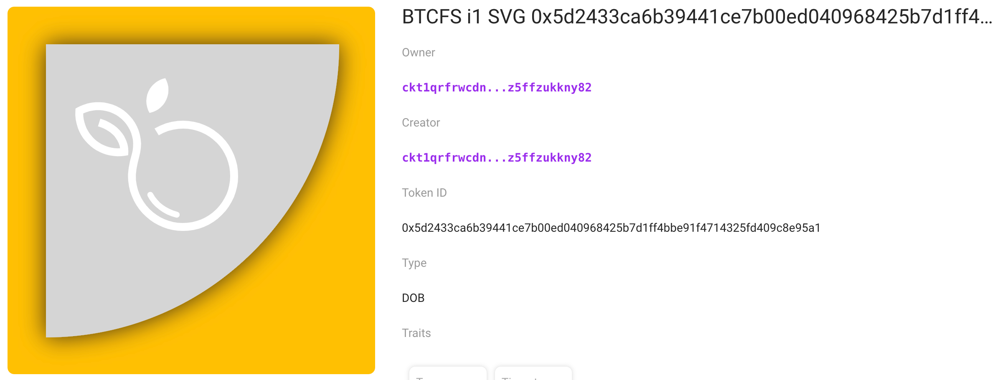

## Intro

This example demonstrates how to create a DOB based on the DOB/0 protocol, using `btcfs://{BTCTX_ID}i1` svg image links as the primary rendering objects. You can view the DOB on JoyID, Omiga, CKB Explorer, Mobit, Dobby. 

<div align="center">
  
</div>

## [Code](./8.btcfs-i1-svg.ts)

```typescript
import { ccc } from "@ckb-ccc/ccc";
import { client, signer } from "@ckb-ccc/playground";

function getExplorerTxUrl(txHash: string) {
  const isMainnet = client.addressPrefix === 'ckb';
  const baseUrl = isMainnet ? 'https://explorer.nervos.org' : 'https://testnet.explorer.nervos.org';

  return `${baseUrl}/transaction/${txHash}`
}

function generateSimpleDNA(length: number): string {
  return Array.from(
    { length }, 
    () => Math.floor(Math.random() * 16).toString(16)
  ).join('');
}

/**
 * Generate cluster description
 */
function generateClusterDescriptionUnderDobProtocol() {
 
  const clusterDescription = "A cluster with btcfs i1 svg as the primary rendering objects.";
  
  const dob0Pattern: ccc.spore.dob.PatternElementDob0[] = [
    {
      traitName: "prev.type",
      dobType: "String",
      dnaOffset: 0,
      dnaLength: 1,
      patternType: "options",
      traitArgs: ['image'],
    },
    {
      traitName: "prev.bg",
      dobType: "String",
      dnaOffset: 1,
      dnaLength: 1,
      patternType: "options",
      traitArgs:[
       "btcfs://8ca2da44996f5a06ad44b5bb87fd9acb71390b6c0cb1910c10b0deb8daad7f82i1",
      ],
    },
    {
      traitName: "prev.bgcolor",
      dobType: "String",
      dnaOffset: 2,
      dnaLength: 1,
      patternType: "options",
      traitArgs:[
       "#FFC103",
      ],
    },
    {
      traitName: "Type",
      dobType: "Number",
      dnaOffset: 3,
      dnaLength: 1,
      patternType: "range",
      traitArgs: [10, 50],
    },
    {
      traitName: "Timestamp",
      dobType: "Number",
      dnaOffset: 4,
      dnaLength: 4,
      patternType: "rawNumber",
    },
  ];

  const dob0: ccc.spore.dob.Dob0 = {
    description: clusterDescription,
    dob: {
      ver: 0,
      decoder: ccc.spore.dob.getDecoder(client, "dob0"),
      pattern: dob0Pattern,
    },
  };

  return ccc.spore.dob.encodeClusterDescriptionForDob0(dob0);
}

/**
 * create cluster
 */
const { tx: clusterTx, id: clusterId } = await ccc.spore.createSporeCluster({
  signer,
  data: {
    name: "BTCFS i1 SVG",
    description: generateClusterDescriptionUnderDobProtocol(),
  },
});
await clusterTx.completeFeeBy(signer, 2000n);
const clusterTxHash = await signer.sendTransaction(clusterTx);
console.log("Create cluster tx sent:", clusterTxHash, `Cluster ID: ${clusterId}`);
await signer.client.waitTransaction(clusterTxHash);
console.log("Create cluster tx committed:", getExplorerTxUrl(clusterTxHash), `Cluster ID: ${clusterId}`);

/**
 * create spore
 */
//const clusterId = '0x8a72b43b66a01aefe6e7ad7258112c63950955f1b07a098b6392278186fe0809';
const { tx: sporeTx, id: sporeId } = await ccc.spore.createSpore({
  signer,
  data: {
    contentType: "dob/0",
    content: ccc.bytesFrom(`{ "dna": "${generateSimpleDNA(16)}" }`, "utf8"),
    clusterId: clusterId,
  },
  clusterMode: "clusterCell",
});
await sporeTx.completeFeeBy(signer, 2000n);
const sporeTxHash = await signer.sendTransaction(sporeTx);
console.log("Mint DOB tx sent:", sporeTxHash, `Spore ID: ${sporeId}`);
await signer.client.waitTransaction(sporeTxHash);
console.log("Mint DOB tx committed:", getExplorerTxUrl(sporeTxHash), `Spore ID: ${sporeId}`);

```

You can also open and edit the code online in [ccc-playground](https://live.ckbccc.com/?src=https://raw.githubusercontent.com/CKBFansDAO/dob-cookbook/refs/heads/main/examples/dob0/8.btcfs-i1-svg.ts):


## On-chain test cluster and DOB

### Testnet
- 👉[🔗 createCluster tx](https://testnet.explorer.nervos.org/transaction/0xff923903cb28c304fdbed4a650fb84eb1a0a84f90e28228bc4b4488ab3b52c2d)
  - clusterId: `0x8a72b43b66a01aefe6e7ad7258112c63950955f1b07a098b6392278186fe0809` (type_script.args)
  - clusterTypeHash: `0x7dff25424aed71c25f8eff3ab94b653d9dc77bf1b16adb33c07174f79b565c2c` (hash(type_script(cluster cell)))

- 👉[🔗 mintSpore tx](https://testnet.explorer.nervos.org/transaction/0x450008926a5caf4fe444872b705da92755720cdf67a5bb15263644bb7dd0cf5b)
  - sporeId: `0x5d2433ca6b39441ce7b00ed040968425b7d1ff4bbe91f4714325fd409c8e95a1` (type_script.args)
  - sporeTypeHash: `0x878fb92c75e8bc214f7f177807fe0d2187a395279218cea9bd463edf3ab111f8` (hash(type_script(spore cell)))

### Mainnet
- 👉[🔗 createCluster tx](https://explorer.nervos.org/transaction/0xc4e5e550b3aa16410da47084a6f7c76efca1baa1c85482d3b85b195357688a0f)
  - clusterId: `0x691254fa8d0dd8904b4abadafa7a94c59a28ce1ba9337f13628bc3bbbc475fa1` (type_script.args)
  - clusterTypeHash: `0xc2d89e681eaf2701378f727cd5d65b9c25ba2584d39f94aa741f89321d7143b0` (hash(type_script(cluster cell)))

- 👉[🔗 mintSpore tx](https://explorer.nervos.org/transaction/0x4fe22a573a96e1b49aec1db770c619f3bc065b819c45e32bb0d7a7e99518774d)
  - sporeId: `0xaeb62bf5e526513a2a3fe523531d3cdeb714f1caeea7f01c59e11ac4e659841b` (type_script.args)
  - sporeTypeHash: `0x78eb16d758a67deb4c8b498a0099c1ed299a71a17fc99b468a6396353b76d7a8` (hash(type_script(spore cell)))
### Platform Preview(Testnet)

### JoyID

<div align="center">
  
</div>

[View on JoyID](https://testnet.joyid.dev/nft/5d2433ca6b39441ce7b00ed040968425b7d1ff4bbe91f4714325fd409c8e95a1) 

### Omiga



[View on Omiga](https://test.omiga.io/info/dobs/0x878fb92c75e8bc214f7f177807fe0d2187a395279218cea9bd463edf3ab111f8) 

### Mobit



[View on mobit](https://mobit.app/dob/5d2433ca6b39441ce7b00ed040968425b7d1ff4bbe91f4714325fd409c8e95a1?chain=ckb)

### Dobby

[View on Dobby(TestNet ❌)](https://test-dobby.entrust3.com/item-detail_ckb/0x5d2433ca6b39441ce7b00ed040968425b7d1ff4bbe91f4714325fd409c8e95a1) 
[View on Dobby(Mainnet ✅)](https://app.dobby.market/item-detail_ckb/0xaeb62bf5e526513a2a3fe523531d3cdeb714f1caeea7f01c59e11ac4e659841b) 

### Explorer

[View on CKB Explorer](https://testnet.explorer.nervos.org/nft-info/0x7dff25424aed71c25f8eff3ab94b653d9dc77bf1b16adb33c07174f79b565c2c/0x5d2433ca6b39441ce7b00ed040968425b7d1ff4bbe91f4714325fd409c8e95a1) 


## Compatibility
|         | JoyID | Omiga | CKB Explorer | Mobit | Dobby |
| ------- | ----- | ----- | ------------ | ----- | ----- |
| Testnet | ✅    | ✅     | ❌           | ✅     | ❌    |
| Mainnet | ✅    | ✅     | ❌           | ✅     | ✅    |    


---
<div align="left">
  
| [← Previous Example](7.btcfs-i1-png.md) |
|:----------------------------------------|
</div>