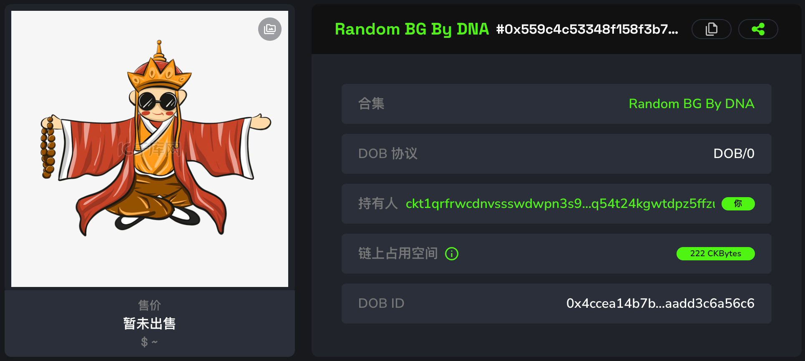
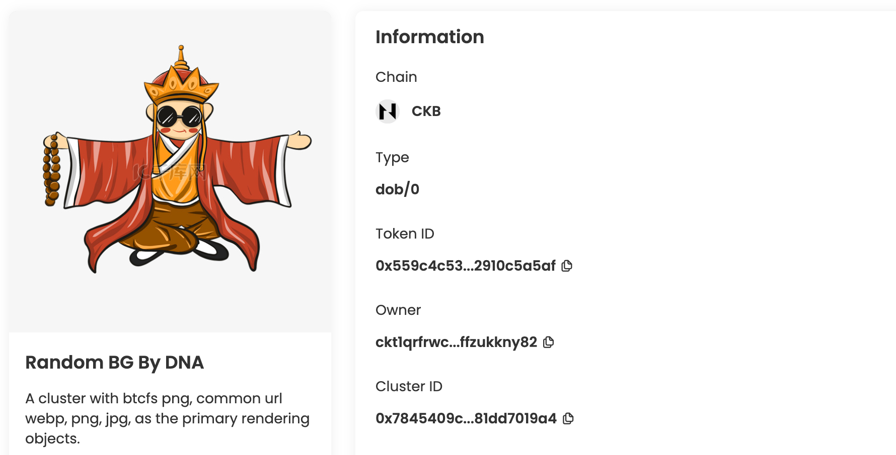
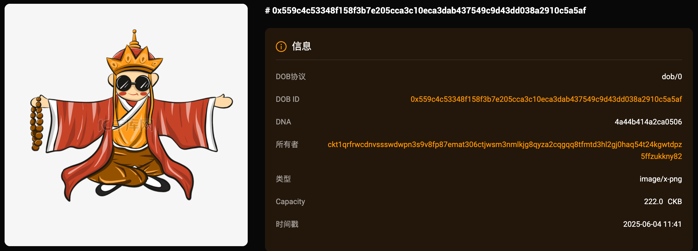
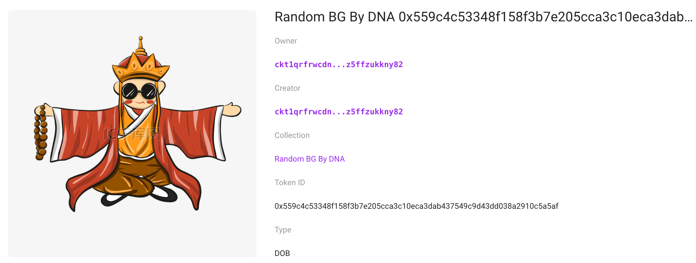

## Intro

This example demonstrates how to create a DOB using the DOB/0 protocol, with programmatic image (BTCFS, IPFS, Regular Link) as the primary rendering objects. You can view the DOB on JoyID, Omiga, CKB Explorer, Mobit, Dobby. 

<div align="center">
  
</div>

## [Code](./9.programmatic-img.ts)

```typescript

import { ccc } from "@ckb-ccc/ccc";
import { client, signer } from "@ckb-ccc/playground";

function getExplorerTxUrl(txHash: string) {
  const isMainnet = client.addressPrefix === 'ckb';
  const baseUrl = isMainnet ? 'https://explorer.nervos.org' : 'https://testnet.explorer.nervos.org';

  return `${baseUrl}/transaction/${txHash}`
}

function generateSimpleDNA(length: number): string {
  return Array.from(
    { length }, 
    () => Math.floor(Math.random() * 16).toString(16)
  ).join('');
}

/**
 * Generate cluster description
 */
function generateClusterDescriptionUnderDobProtocol() {
 
  const clusterDescription = "A cluster with btcfs png, common url webp, png, jpg, as the primary rendering objects.";
  
  const dob0Pattern: ccc.spore.dob.PatternElementDob0[] = [
    {
      traitName: "prev.type",
      dobType: "String",
      dnaOffset: 0,
      dnaLength: 1,
      patternType: "options",
      traitArgs: ['image'],
    },
    {
      traitName: "prev.bg",
      dobType: "String",
      dnaOffset: 1,
      dnaLength: 1,
      patternType: "options",
      traitArgs:[
       "btcfs://545b94cb1ecf2175b81c601346e4a7e05149cafc6f235330c9918e35f920e109i0",
       "https://wy-static.wenxiaobai.com/aigc-online/delogo_17f20621-71b0-7f63-e205-11ac0d933b08.webp",
       "https://img.lovepik.com/free-png/20220121/lovepik-sitting-down-png-image_401582943_wh860.png",
       "https://bpic.588ku.com/element_origin_min_pic/23/04/24/7757e0e10ff009e0f399ee6748a91893.jpg",
       "ipfs://QmRRPWG96cmgTn2qSzjwr2qvfNEuhunv6FNeMFGa9bx6mQ"
      ],
    },
    {
      traitName: "prev.bgcolor",
      dobType: "String",
      dnaOffset: 2,
      dnaLength: 1,
      patternType: "options",
      traitArgs:[
       "#E0E1E2",
      ],
    },
    {
      traitName: "USDI Value",
      dobType: "Number",
      dnaOffset: 1,
      dnaLength: 1,
      patternType: "options",
      traitArgs: [5, 10, 20, 50, 100, 200, 500, 1000],
    }
  ];

  const dob0: ccc.spore.dob.Dob0 = {
    description: clusterDescription,
    dob: {
      ver: 0,
      decoder: ccc.spore.dob.getDecoder(client, "dob0"),
      pattern: dob0Pattern,
    },
  };

  return ccc.spore.dob.encodeClusterDescriptionForDob0(dob0);
}

/**
 * create cluster
 */

const { tx: clusterTx, id: clusterId } = await ccc.spore.createSporeCluster({
  signer,
  data: {
    name: "Programmatic Image By DNA",
    description: generateClusterDescriptionUnderDobProtocol(),
  },
});
await clusterTx.completeFeeBy(signer, 2000n);
const clusterTxHash = await signer.sendTransaction(clusterTx);
console.log("Create cluster tx sent:", clusterTxHash, `Cluster ID: ${clusterId}`);
await signer.client.waitTransaction(clusterTxHash);
console.log("Create cluster tx committed:", getExplorerTxUrl(clusterTxHash), `Cluster ID: ${clusterId}`);

/**
 * create spore
 */
// testnet
//const clusterId = '0x7845409c6c69be05c8b9987c7a6177c2bc04c43f616a1e354a392381dd7019a4';
// mainnet 
//const clusterId = '0x2376a28a9e62a078204ffec136878fbabc81adaa47cdc1f39912f948dbffc57e';
const { tx: sporeTx, id: sporeId } = await ccc.spore.createSpore({
  signer,
  data: {
    contentType: "dob/0",
    content: ccc.bytesFrom(`{ "dna": "${generateSimpleDNA(16)}" }`, "utf8"),
    clusterId: clusterId,
  },
  clusterMode: "clusterCell",
});
await sporeTx.completeFeeBy(signer, 2000n);
const sporeTxHash = await signer.sendTransaction(sporeTx);
console.log("Mint DOB tx sent:", sporeTxHash, `Spore ID: ${sporeId}`);
await signer.client.waitTransaction(sporeTxHash);
console.log("Mint DOB tx committed:", getExplorerTxUrl(sporeTxHash), `Spore ID: ${sporeId}`);


/**
 * The code below helps you to view the dob you just minted
 */

const getDobTypeHash = (sporeId: string, version?: ccc.spore.SporeVersion | ccc.spore.SporeVersion.V2 )  => {
    const sporeScriptInfo = ccc.spore.getSporeScriptInfo(client, version)
    const dobTypeScript = ccc.Script.from({
        codeHash: sporeScriptInfo.codeHash,
        hashType: sporeScriptInfo.hashType,
        args: sporeId
    })

    return dobTypeScript.hash();
}

const getClusterTypeHash = (clusterId: string, version?: ccc.spore.SporeVersion | ccc.spore.SporeVersion.V2 )  => {
    const clusterScriptInfo = ccc.spore.getClusterScriptInfo(client, version)
    const clusterTypeScript = ccc.Script.from({
        codeHash: clusterScriptInfo.codeHash,
        hashType: clusterScriptInfo.hashType,
        args: clusterId
    })

    return clusterTypeScript.hash();
}

enum PlatformSupportedDOB {
  JOYID = "joyid",
  CKBEXPLORER = "ckb explorer",
  OMIGA = "omiga",
  DOBBY = "dobby",
  MOBIT = "mobit",
}

const viewDobUrl = (platform : PlatformSupportedDOB, clusterId: string, sporeId: string) => {
    const isMainnet = client.addressPrefix === 'ckb';
    let url = ''

    switch (platform) {
        case PlatformSupportedDOB.JOYID:
            url = isMainnet 
                ? `https://app.joy.id/nft/${sporeId.slice(2)}`
                : `https://testnet.joyid.dev/nft/${sporeId.slice(2)}`;
            break;
        case PlatformSupportedDOB.OMIGA:
            const sporeTypeHash = getDobTypeHash(sporeId);
            url = isMainnet
                ? `https://omiga.io/info/dobs/${sporeTypeHash}`
                : `https://test.omiga.io/info/dobs/${sporeTypeHash}`;
            break;
        case PlatformSupportedDOB.CKBEXPLORER:
            const clusterTypeHash = getClusterTypeHash(clusterId);
            url = isMainnet
                ? `https://explorer.nervos.org/nft-info/${clusterTypeHash}/${sporeId}`
                : `https://testnet.explorer.nervos.org/nft-info/${clusterTypeHash}/${sporeId}`;
            break;
        case PlatformSupportedDOB.DOBBY:
            url = isMainnet
                ? `https://app.dobby.market/item-detail_ckb/${sporeId}`
                : `https://test-dobby.entrust3.com/item-detail_ckb/${sporeId}`;
            break;
        case PlatformSupportedDOB.MOBIT:
            url = isMainnet
                ? `https://mobit.app/dob/${sporeId.slice(2)}?chain=ckb`
                : `https://mobit.app/dob/${sporeId.slice(2)}?chain=ckb`;
            break;
        default:
            throw new Error(`Unsupported platform: ${platform}`);
    }
    
    return url;
}

console.log('Now you can view the dob on JoyId, Omiga, CKB Explorer, Mobit, Dobby...');
Object.values(PlatformSupportedDOB).forEach(platform => {
    console.log(`View on ${platform}: 👉🔗`, viewDobUrl(platform, clusterId, sporeId));
});
```

You can also open and edit the code online in [ccc-playground](https://live.ckbccc.com/?src=https://raw.githubusercontent.com/sporeprotocol/dob-cookbook/refs/heads/main/examples/dob0/9.programmatic-img.ts):


This example adds 3 traits to set the background image: 
- **`prev.type`** : Render as `image` or `text`.
- **`prev.bg`** : Set the background image.
- **`prev.bgcolor`** : Set the background color.


## On-chain test cluster and DOB

### Testnet
- 👉[🔗 createCluster tx](https://testnet.explorer.nervos.org/transaction/0xd62157df5ee10ab4dc10a903be9a6d159e80723f10aa0415af59331bad6b67c8)
  - clusterId: `0x7845409c6c69be05c8b9987c7a6177c2bc04c43f616a1e354a392381dd7019a4` (type_script.args)
  - clusterTypeHash: `0xae57dca034c0e24c27f054c16c49178aa0f9c5ac17f017f7c5881dc3a2e704c6` (hash(type_script(cluster cell)))

- 👉[🔗 mintSpore tx](https://testnet.explorer.nervos.org/transaction/0x8ac707a5312454d5195a961be602e88759e5666ec95153845143273c056acff4)
  - sporeId: `0x559c4c53348f158f3b7e205cca3c10eca3dab437549c9d43dd038a2910c5a5af` (type_script.args)
  - sporeTypeHash: `0x4ccea14b7bcd4ce2a6055b44f5ec8c25078aa7b9739d65c66a2aaadd3c6a56c6` (hash(type_script(spore cell)))

### Mainnet
- 👉[🔗 createCluster tx](https://explorer.nervos.org/transaction/0xcb54936dcf3b20b10743fbfa615931a4e8b0244561e63762d781c1f59618e8f3)
  - clusterId: `0x2376a28a9e62a078204ffec136878fbabc81adaa47cdc1f39912f948dbffc57e` (type_script.args)
  - clusterTypeHash: `0x46cb7c83c5fc1cc21a4dbdf771730823f69aabb968aff44c41f20f4155668e56` (hash(type_script(cluster cell)))

- 👉[🔗 mintSpore tx](https://explorer.nervos.org/transaction/0x3f0750207edd652bbc25349406c68b9b4435aaab7c9559efcb35487d3f956241)
  - sporeId: `0x81cb54dfe6aef91c4659bd71813d0f787dcf532c347c8e983546973db455c7c0` (type_script.args)
  - sporeTypeHash: `0x42e7496704fe72b62e9fd666e2e4edd4cf6fca6e8b9d847cf9f221124dd7029c` (hash(type_script(spore cell)))


### Platform Preview(Testnet)

### JoyID

<div align="center">
  
</div>

[View on JoyID](https://testnet.joyid.dev/nft/559c4c53348f158f3b7e205cca3c10eca3dab437549c9d43dd038a2910c5a5af) 

### Omiga



[View on Omiga](https://test.omiga.io/info/dobs/0x4ccea14b7bcd4ce2a6055b44f5ec8c25078aa7b9739d65c66a2aaadd3c6a56c6) 

### Mobit



[View on mobit](https://mobit.app/dob/559c4c53348f158f3b7e205cca3c10eca3dab437549c9d43dd038a2910c5a5af?chain=ckb)

### Dobby

[View on Dobby](https://test-dobby.entrust3.com/item-detail_ckb/0x559c4c53348f158f3b7e205cca3c10eca3dab437549c9d43dd038a2910c5a5af) 

### Explorer

[View on CKB Explorer](https://testnet.explorer.nervos.org/nft-info/0x574c7a019d7cbb584e2f75ed69f69047de6a2dd1b0fb2da3b1153c11155ce12a/0x559c4c53348f158f3b7e205cca3c10eca3dab437549c9d43dd038a2910c5a5af) 


## Compatibility
|         | JoyID | Omiga | CKB Explorer | Mobit | Dobby |
| ------- | ----- | ----- | ------------ | ----- | ----- |
| Testnet | ✅    | ✅     | ✅           | ✅     | ✅    |
| Mainnet | ✅    | ✅     | ✅           | ✅     | ✅    |


---
<div align="left">
  
| [← Previous Example](8.btcfs-i1-svg.md) |
|:------------------------------------|
</div