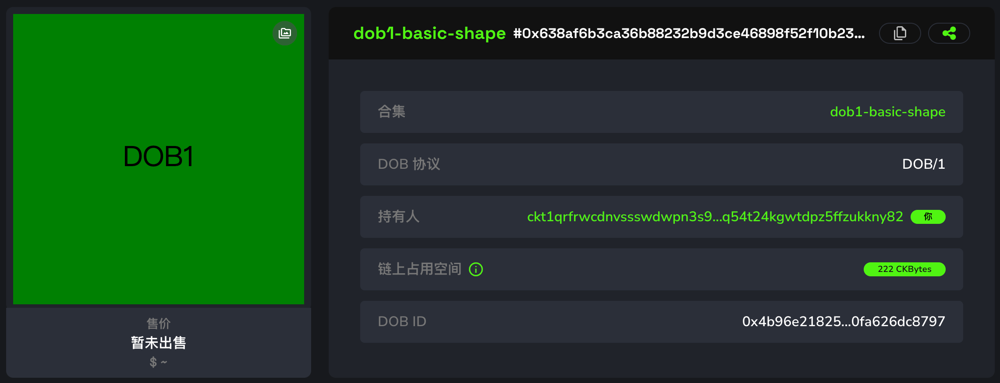
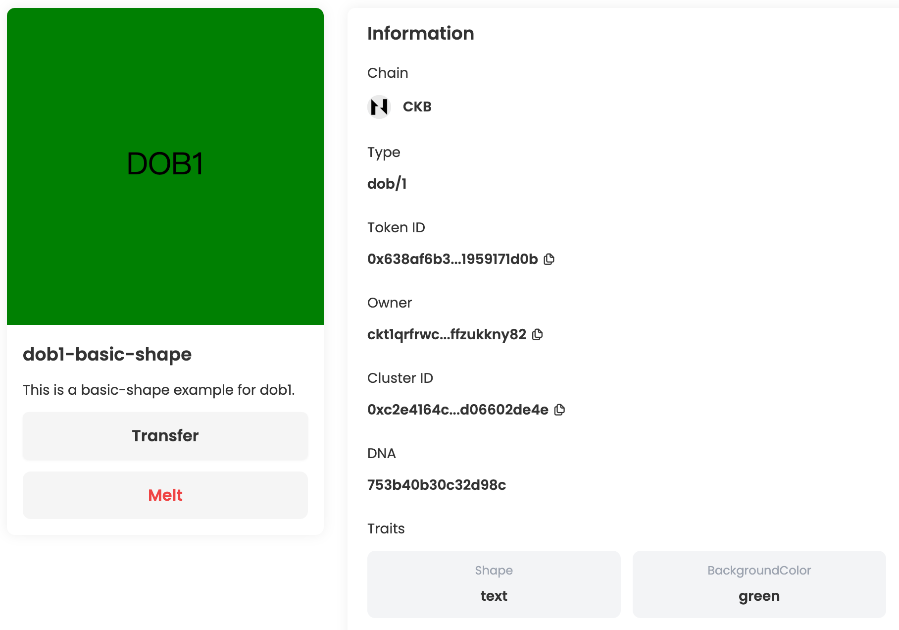
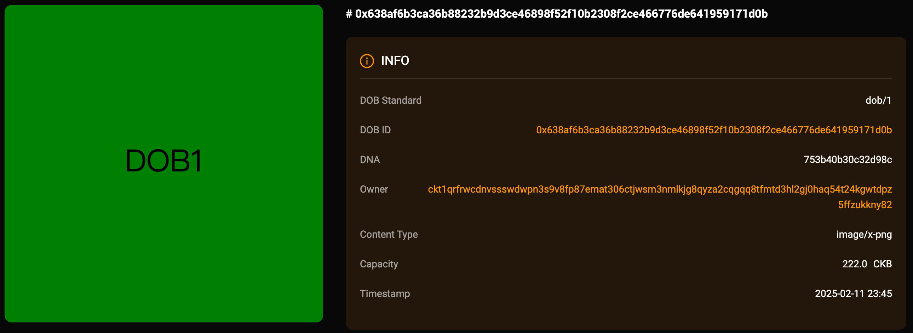
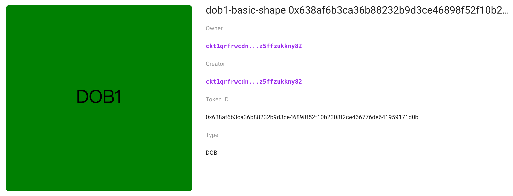

## Intro
This example demonstrates the basic usage of DOB1 protocol, including creating a cluster and minting a DOB1. Afterward, you can view the DOB on JoyID, Omiga, CKB Explorer, Mobit, Dobby. 

<div align="center">
  
</div>

## [Code](./0.basic-shape.ts)

```typescript
import { ccc } from "@ckb-ccc/ccc";
import { client, signer } from "@ckb-ccc/playground";

function getExplorerTxUrl(txHash: string) {
  const isMainnet = client.addressPrefix === 'ckb';
  const baseUrl = isMainnet ? 'https://explorer.nervos.org' : 'https://testnet.explorer.nervos.org';

  return `${baseUrl}/transaction/${txHash}`
}

function generateSimpleDNA(length: number): string {
  return Array.from(
    { length }, 
    () => Math.floor(Math.random() * 16).toString(16)
  ).join('');
}

function generateClusterDescriptionUnderDobProtocol() {
  /**
   * Generation example for DOB0
   */
  const clusterDescription = "This is a basic-shape example for dob1.";
  const dob0Pattern: ccc.spore.dob.PatternElementDob0[] = [
    {
      traitName: "Shape",
      dobType: "String",
      dnaOffset: 1,
      dnaLength: 1,
      patternType: "options",
      traitArgs: ["circle", "square", "triangle", "star", "text"],
    },
    {
      traitName: "BackgroundColor",
      dobType: "String",
      dnaOffset: 0,
      dnaLength: 1,
      patternType: "options",
      traitArgs: ["red", "blue", "green", "yellow", "pink"],
    }
  ];
  
  /**
   * Generation example for DOB1
   */
  const dob1Pattern: ccc.spore.dob.PatternElementDob1[] = [
    {
      imageName: "IMAGE.0",
      svgFields: "attributes",
      traitName: "",
      patternType: "raw",
      traitArgs: "xmlns='http://www.w3.org/2000/svg' viewBox='0 0 500 500'",
    },
    {
      imageName: "IMAGE.0",
      svgFields: "elements",
      traitName: "BackgroundColor",
      patternType: "options",
      traitArgs: [
        ["red", "<rect width='500' height='500' x='0' y='0' fill='red' />"],
        ["blue", "<rect width='500' height='500' x='0' y='0' fill='blue' />"],
        ["green", "<rect width='500' height='500' x='0' y='0' fill='green' />"],
        ["yellow", "<rect width='500' height='500' x='0' y='0' fill='yellow' />"],
        [["*"], "<rect width='500' height='500' x='0' y='0' fill='pink' />"],
      ]
    },
    {
      imageName: "IMAGE.0",
      svgFields: "elements",
      traitName: "Shape",
      patternType: "options",
      traitArgs: [
        ["circle", "<circle cx='250' cy='250' r='150' fill='white' stroke='black' stroke-width='2' />"],
        ["square", "<rect width='300' height='300' x='100' y='100' fill='white' stroke='black' stroke-width='2' />"],
        ["triangle", "<polygon points='250,100 400,400 100,400' fill='white' stroke='black' stroke-width='2' />"],
        ["star", "<path d='M250 100 L290 200 L400 200 L310 260 L340 370 L250 300 L160 370 L190 260 L100 200 L210 200 Z' fill='white' stroke='black' stroke-width='2' />"],
        ["text", "<text x='250' y='250' text-anchor='middle' dominant-baseline='middle' font-size='48' fill='black'>DOB1</text>"],
        [["*"], "<circle cx='250' cy='250' r='150' fill='white' stroke='black' stroke-width='2' />"]
      ],
    }
  ];

  const dob1: ccc.spore.dob.Dob1 = {
    description: clusterDescription,
    dob: {
      ver: 1,
      decoders: [
        {
          decoder: ccc.spore.dob.getDecoder(client, "dob0"),
          pattern: dob0Pattern,
        },
        {
          decoder: ccc.spore.dob.getDecoder(client, "dob1"),
          pattern: dob1Pattern,
        },
      ],
    },
  };

  return ccc.spore.dob.encodeClusterDescriptionForDob1(dob1);
}


/**
 * create cluster
 */

const { tx: clusterTx, id: clusterId } = await ccc.spore.createSporeCluster({
  signer,
  data: {
    name: "dob1-basic-shape",
    description: generateClusterDescriptionUnderDobProtocol(),
  },
});
await clusterTx.completeFeeBy(signer, 2000n);
const clusterTxHash = await signer.sendTransaction(clusterTx);
console.log("Create cluster tx sent:", clusterTxHash, `Cluster ID: ${clusterId}`);

/**
 * create spore
 */
//const clusterId = '0xc2e4164c6b390b0ca31138d1715201c24dc9aafae1a75b1047763cd06602de4e';
const { tx: sporeTx, id: sporeId } = await ccc.spore.createSpore({
  signer,
  data: {
    contentType: "dob/0",
    content: ccc.bytesFrom(`{ "dna": "${generateSimpleDNA(16)}" }`, "utf8"),
    clusterId: clusterId,
  },
  clusterMode: "clusterCell",
});
await sporeTx.completeFeeBy(signer, 2000n);
const sporeTxHash = await signer.sendTransaction(sporeTx);
console.log("Mint DOB tx sent:", sporeTxHash, `Spore ID: ${sporeId}`);

await signer.client.waitTransaction(clusterTxHash);
console.log("Create cluster tx committed:", getExplorerTxUrl(clusterTxHash), `Cluster ID: ${clusterId}`);
await signer.client.waitTransaction(sporeTxHash);
console.log("Mint DOB tx committed:", getExplorerTxUrl(sporeTxHash), `Spore ID: ${sporeId}`);

```

You can also open and edit the code online in [ccc-playground](https://live.ckbccc.com/?src=https://raw.githubusercontent.com/CKBFansDAO/dob-cookbook/refs/heads/main/examples/dob1/0.basic-shape.ts):


## On-chain test cluster and DOB

### Testnet
- 👉[🔗 createCluster tx](https://testnet.explorer.nervos.org/transaction/0xe08d2363af1dcd5319c99e3f4996c0015145bbc0d0802480c31a1388d76cbe4d)
  - clusterId: `0xc2e4164c6b390b0ca31138d1715201c24dc9aafae1a75b1047763cd06602de4e` (type_script.args)
  - clusterTypeHash: `0xe55557af70bd7912364a1ea87c42a1e85fd6e886c5070f86f3a075bda8fd70ec` (hash(type_script(cluster cell)))

- 👉[🔗 mintSpore tx](https://testnet.explorer.nervos.org/transaction/0x991a04f54fdb92414228b65a61c572c47caa52d6acb48d5a3cdf7d7f65a9539b)
  - sporeId: `0x638af6b3ca36b88232b9d3ce46898f52f10b2308f2ce466776de641959171d0b` (type_script.args)
  - sporeTypeHash: `0x4b96e21825674147aad632c24b1e9b41eb865781032ce77d27390fa626dc8797` (hash(type_script(spore cell)))

### Mainnet
- 👉[🔗 createCluster tx](https://explorer.nervos.org/transaction/0x40449b80339a6cbb2fd74e3f511b367d82aa888040648c712e5000b5286f2e8b)
  - clusterId: `0xd7c32f5bc9b7b76efcbd455e58933dd449ccc7e7150e0f36fa71b44c7272362b` (type_script.args)
  - clusterTypeHash: `0x3f16e12dd7bb8b790fb4141c0bf6a17d33ee55919856e7f4bed103b30d9207f8` (hash(type_script(cluster cell)))

- 👉[🔗 mintSpore tx](https://explorer.nervos.org/transaction/0x49e22275cbd55bce814192b8f8913d3a977d0f9dca41828eb384836d40066237)
  - sporeId: `0x09e8b9dd7f8c5f4ee2bb8d4546fcabd304434e3f958b3206f32dce98f9b35265` (type_script.args)
  - sporeTypeHash: `0xe09b872be9b58bdb8f32dae653ebffdf84e5bcdadad08f862ac2bf8306065537` (hash(type_script(spore cell)))

### Platform Preview(Testnet)

### JoyID

<div align="center">
  
</div>

[View on JoyID](https://testnet.joyid.dev/nft/638af6b3ca36b88232b9d3ce46898f52f10b2308f2ce466776de641959171d0b) 

### Omiga



[View on Omiga](https://test.omiga.io/info/dobs/0x4b96e21825674147aad632c24b1e9b41eb865781032ce77d27390fa626dc8797) 

### Mobit


[View on mobit](https://mobit.app/dob/638af6b3ca36b88232b9d3ce46898f52f10b2308f2ce466776de641959171d0b?chain=ckb)

### Dobby

[View on Dobby](https://test-dobby.entrust3.com/item-detail_ckb/0x638af6b3ca36b88232b9d3ce46898f52f10b2308f2ce466776de641959171d0b) 

### Explorer

[View on CKB Explorer](https://testnet.explorer.nervos.org/nft-info/0xfa91828e4085425048e4aeacf7441cb3ebc56b3c6b7a2b77e83066567bf225dd/0x638af6b3ca36b88232b9d3ce46898f52f10b2308f2ce466776de641959171d0b) 


## Compatibility
|         | JoyID | Omiga | CKB Explorer | Mobit | Dobby |
| ------- | ----- | ----- | ------------ | ----- | ----- |
| Testnet | ✅    | ✅     | ❌           | ✅     | ❌    |
| Mainnet | 

---
<div align="right">
  
| [Next Example →](1.spore-genesis(svg_bg_btcfs_icon).md) |
|-------------------------------------:|
</div
